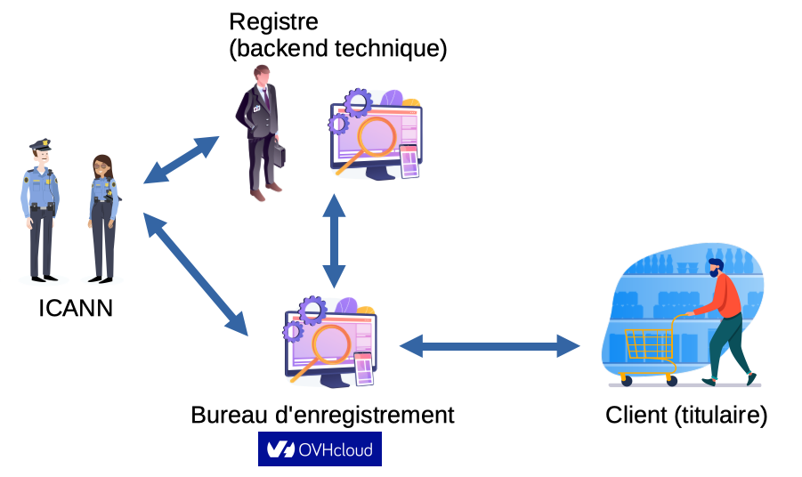

<!-- markdownlint-disable MD001 MD026 MD033 MD045 -->

<!-- Compile to HTML with `marp -w -s --html true .`
     (if it raises a watch error, disable git FS monitoring first with `git config core.fsmonitor false`) -->

<!-- https://marpit.marp.app/markdown -->

<style>
    @import url('./slide-deck.css');
</style>

<div class="flex vertical center">


<!-- Photo de <a href="https://unsplash.com/fr/@choys_">Conny Schneider</a> sur <a href="https://unsplash.com/fr/photos/a-blue-background-with-lines-and-dots-xuTJZ7uD7PI">Unsplash</a> -->

# The Great Tale

### of Humble Domain Names

## **Extensions**

<div class="spacer"></div>

Théo Bougé & Benoît Masson - 

<div class="spacer"></div>

<div class="backgroundColorWhite">

</div>

</div>

---

<div class="flex vertical space-between">

## Who are we?

<div class="horizontal space-around">

<div class="vertical start">

### Théo


<sre@pu.domains>

</div>
<div class="vertical start">

### Benoît


<developer@pu.domains>

</div>

</div>


---


<!-- Photo de <a href="https://unsplash.com/fr/@joshua_hoehne">Joshua Hoehne</a> sur <a href="https://unsplash.com/fr/photos/papier-dimprimante-blanc-avec-texte-noir-1UDjq8s8cy0">Unsplash</a> -->

<div class="flex vertical space-around">

# 1. Domain Names & Extensions

<!-- CHECKPOINT < 02:00 -->

</div>

---

<!-- CHECKPOINT < 08:00 -->

<div class="flex vertical start">

## Domain name

URL: `https://www.ovhcloud.com:8080/mail`

</div>

---

<!-- CHECKPOINT < 08:00 -->

<div class="flex vertical start">

## Domain name

URL: `https://www.ovhcloud.com:8080/mail`

- `https`: protocol
- `www`: host name / sub domain
- `ovhcloud.com`: **domain name**
- `8080`: port
- `/mail`: access path

</div>

---

<!-- CHECKPOINT < 08:00 -->

<div class="flex vertical start">

## `ovhcloud.com`

- `ovhcloud`: label
- `com`: **extension**

</div>

---

<!-- CHECKPOINT < 08:00 -->

<div class="flex vertical start">

### Quizz: Who's that ~~Pokemon~~ Extension?

- `toto.fr`

</div>

---

<!-- CHECKPOINT < 08:00 -->

<div class="flex vertical start">

### Quizz: Who's that ~~Pokemon~~ Extension?

- `toto.fr` => `fr`
- `com.toto.fr`

</div>

---

<!-- CHECKPOINT < 08:00 -->

<div class="flex vertical start">

### Quizz: Who's that ~~Pokemon~~ Extension?

- `toto.fr` => `fr`
- `com.toto.fr` => `fr`
- `toto.gouv.fr`

</div>

---

<!-- CHECKPOINT < 08:00 -->

<div class="flex vertical start">

### Quizz: Who's that ~~Pokemon~~ Extension?

- `toto.fr` => `fr`
- `com.toto.fr` => `fr`
- `toto.gouv.fr` => `gouv.fr`
- `toto.com.fr`

</div>

---

<!-- CHECKPOINT < 08:00 -->

<div class="flex vertical start">

### Quizz: Who's that ~~Pokemon~~ Extension?

- `toto.fr` => `fr`
- `com.toto.fr` => `fr`
- `toto.gouv.fr` => `gouv.fr`
- `toto.com.fr` => `com.fr`
- `toto.fr.com`

</div>

---

<!-- CHECKPOINT < 08:00 -->

<div class="flex vertical start">

### Quizz: Who's that ~~Pokemon~~ Extension?

- `toto.fr` => `fr`
- `com.toto.fr` => `fr`
- `toto.gouv.fr` => `gouv.fr`
- `toto.com.fr` => `com.fr` // TODO: remove
- `toto.fr.com` => `com` // TODO: remove
- `toto.notaires.fr`

</div>

---

<!-- CHECKPOINT < 08:00 -->

<div class="flex vertical start">

### Quizz: Who's that ~~Pokemon~~ Extension?

- `toto.fr` => `fr`
- `com.toto.fr` => `fr`
- `toto.gouv.fr` => `gouv.fr`
- `toto.com.fr` => `com.fr`
- `toto.fr.com` => `com`
- `toto.notaires.fr` => `fr`

</div>

---

<!-- CHECKPOINT < 08:00 -->

<div class="flex vertical start">

## Extension Types (1)

- **TLD** (Top-Level Domain): `.fr`
- SLD (Second-Level Domain): `.gouv.fr`
- 3LD (Third-Level Domain): `.anjo.aichi.jp`

<div class="spacer"></div>

Public list (_unofficial_) @ <https://publicsuffix.org/list/>

</div>

---

<!-- CHECKPOINT < 08:00 -->

<div class="flex vertical start">

## Extension Types (2)

- **ccTLD** (Country-Code TLD)
- **gTLD** (Generic TLD)

</div>

---

<!-- CHECKPOINT < 08:00 -->

<div class="flex vertical start">

## Quizz: ccTLD 🏳️‍🌈 or gTLD 🌍 ?

<div class="horizontal start">

- `fr`

</div>

---

<!-- CHECKPOINT < 08:00 -->

<div class="flex vertical start">

## Quizz: ccTLD 🏳️‍🌈 or gTLD 🌍 ?

<div class="horizontal start">

- `fr` => 🇫🇷
- `com`

</div>

---

<!-- CHECKPOINT < 08:00 -->

<div class="flex vertical start">

## Quizz: ccTLD 🏳️‍🌈 or gTLD 🌍 ?

<div class="horizontal start">

- `fr` => 🇫🇷
- `com` => 🌍
- `co`

</div>

---

<!-- CHECKPOINT < 08:00 -->

<div class="flex vertical start">

## Quizz: ccTLD 🏳️‍🌈 or gTLD 🌍 ?

<div class="horizontal start">

- `fr` => 🇫🇷
- `com` => 🌍
- `co` => 🇨🇴
- `gouv.fr`

</div>

---

<!-- CHECKPOINT < 08:00 -->

<div class="flex vertical start">

## Quizz: ccTLD 🏳️‍🌈 or gTLD 🌍 ?

<div class="horizontal start">

- `fr` => 🇫🇷
- `com` => 🌍
- `co` => 🇨🇴
- `gouv.fr` => 🇫🇷
- `bzh`

</div>

---

<!-- CHECKPOINT < 08:00 -->

<div class="flex vertical start">

## Quizz: ccTLD 🏳️‍🌈 or gTLD 🌍 ?

<div class="horizontal start">

- `fr` => 🇫🇷
- `com` => 🌍
- `co` => 🇨🇴
- `gouv.fr` => 🇫🇷
- `bzh` => 🌍
- `eu`

</div>

---

<!-- CHECKPOINT < 08:00 -->

<div class="flex vertical start">

## Quizz: ccTLD 🏳️‍🌈 or gTLD 🌍 ?

<div class="horizontal start">

- `fr` => 🇫🇷
- `com` => 🌍
- `co` => 🇨🇴
- `gouv.fr` => 🇫🇷
- `bzh` => 🌍
- `eu` => 🇪🇺

<div class="hspacer"></div>

- `ευ`

</div>

</div>

---

<!-- CHECKPOINT < 08:00 -->

<div class="flex vertical start">

## Quizz: ccTLD 🏳️‍🌈 or gTLD 🌍 ?

<div class="horizontal start">

- `fr` => 🇫🇷
- `com` => 🌍
- `co` => 🇨🇴
- `gouv.fr` => 🇫🇷
- `bzh` => 🌍
- `eu` => 🇪🇺

<div class="hspacer"></div>

- `ευ` => 🇪🇺
- `asia`

</div>

</div>

---

<!-- CHECKPOINT < 08:00 -->

<div class="flex vertical start">

## Quizz: ccTLD 🏳️‍🌈 or gTLD 🌍 ?

<div class="horizontal start">

- `fr` => 🇫🇷
- `com` => 🌍
- `co` => 🇨🇴
- `gouv.fr` => 🇫🇷
- `bzh` => 🌍
- `eu` => 🇪🇺

<div class="hspacer"></div>

- `ευ` => 🇪🇺
- `asia` => 🌍
- `dev`

</div>

</div>

---

<!-- CHECKPOINT < 08:00 -->

<div class="flex vertical start">

## Quizz: ccTLD 🏳️‍🌈 or gTLD 🌍 ?

<div class="horizontal start">

- `fr` => 🇫🇷
- `com` => 🌍
- `co` => 🇨🇴
- `gouv.fr` => 🇫🇷
- `bzh` => 🌍
- `eu` => 🇪🇺

<div class="hspacer"></div>

- `ευ` => 🇪🇺
- `asia` => 🌍
- `dev` => 🌍
- `ai`

</div>

</div>

---

<!-- CHECKPOINT < 08:00 -->

<div class="flex vertical start">

## Quizz: ccTLD 🏳️‍🌈 or gTLD 🌍 ?

<div class="horizontal start">

- `fr` => 🇫🇷
- `com` => 🌍
- `co` => 🇨🇴
- `gouv.fr` => 🇫🇷
- `bzh` => 🌍
- `eu` => 🇪🇺

<div class="hspacer"></div>

- `ευ` => 🇪🇺
- `asia` => 🌍
- `dev` => 🌍
- `ai` => 🇦🇮
- `tv`

</div>

</div>

---

<!-- CHECKPOINT < 08:00 -->

<div class="flex vertical start">

## Quizz: ccTLD 🏳️‍🌈 or gTLD 🌍 ?

<div class="horizontal start">

- `fr` => 🇫🇷
- `com` => 🌍
- `co` => 🇨🇴
- `gouv.fr` => 🇫🇷
- `bzh` => 🌍
- `eu` => 🇪🇺

<div class="hspacer"></div>

- `ευ` => 🇪🇺
- `asia` => 🌍
- `dev` => 🌍
- `ai` => 🇦🇮
- `tv` => 🇹🇻
- `radio`

</div>

---

<!-- CHECKPOINT < 08:00 -->

<div class="flex vertical start">

## Quizz: ccTLD 🏳️‍🌈 or gTLD 🌍 ?

<div class="horizontal start">

- `fr` => 🇫🇷
- `com` => 🌍
- `co` => 🇨🇴 // TODO: remove
- `gouv.fr` => 🇫🇷
- `bzh` => 🌍
- `eu` => 🇪🇺 // TODO: remove

<div class="hspacer"></div>

- `ευ` => 🇪🇺
- `asia` => 🌍
- `dev` => 🌍
- `ai` => 🇦🇮
- `tv` => 🇹🇻 // TODO: remove
- `radio` => 🌍 // TODO: remove

</div>

</div>

---

<!-- CHECKPOINT < 08:00 -->

<div class="flex vertical start">

## Special chars (non-ASCII)

- **IDN** (International Domain Name) since 2003
  - for label and/or extension

- encoding _Unicode_ to _Punycode_
  - `ευ` <=> `xn--qxa6a`

</div>

---

<!-- CHECKPOINT < 08:00 -->


<!-- Photo de <a href="https://unsplash.com/fr/@j_harris_391">Joshua Harris</a> sur <a href="https://unsplash.com/fr/photos/un-poteau-avec-un-tas-de-panneaux-de-signalisation-jaunes-dessus-BwH31YGYXho">Unsplash</a> -->

<div class="flex vertical space-around">

# 2. DNS

</div>

---

<!-- CHECKPOINT < 15:00 -->
<!-- Théo -->

<div class="flex vertical start">


## tales // TODO: trouver un titre

</div>

---

<!-- CHECKPOINT < 15:00 -->
<!-- Théo -->

<div class="flex vertical start">


</div>

---

<!-- CHECKPOINT < 15:00 -->

<!-- Théo -->

<div class="flex vertical start">


</div>

---

<!-- CHECKPOINT < 15:00 -->
<!-- Théo -->

<div class="flex vertical start">


</div>

---

<!-- CHECKPOINT < 15:00 -->
<!-- Théo -->

<div class="flex vertical start">


</div>

---

<!-- CHECKPOINT < 15:00 -->
<!-- Théo -->

<div class="flex vertical start">


</div>

---

<!-- CHECKPOINT < 15:00 -->
<!-- Théo -->

<div class="flex vertical start">


</div>

---

<!-- CHECKPOINT < 15:00 -->
<!-- Théo -->

<div class="flex vertical start">

## Zonefile

```txt
$ORIGIN example.com.
$TTL 3600
example.com.  IN  SOA   ns.example.com. username.example.com. ( 2020091025 7200 3600 1209600 3600 )

example.com.  IN  NS    ns
example.com.  IN  NS    ns.somewhere.example.
example.com.  IN  MX    10 mail.example.com.
@             IN  MX    20 mail2.example.com.
@             IN  MX    50 mail3
example.com.  IN  A     192.0.2.1
              IN  AAAA  2001:db8:10::1
ns            IN  A     192.0.2.2
              IN  AAAA  2001:db8:10::2
www           IN  CNAME example.com.
wwwtest       IN  CNAME www
mail          IN  A     192.0.2.3
mail2         IN  A     192.0.2.4
mail3         IN  A     192.0.2.5
```

</div>

---

<!-- CHECKPOINT < 15:00 -->
<!-- Théo -->

<div class="flex vertical start">

## Quizz ❓🧭

- <www.toto.fr> ? 🔍

</div>

---

<!-- CHECKPOINT < 15:00 -->
<!-- Théo -->

<div class="flex vertical start">

## Quizz ❓🧭

- <www.toto.fr> ? 🔍
  DNS root 🌐 -> DNS fr 🇫🇷 -> DNS toto.fr ✅
- <www.toto.gouv.fr> ? 🏛️

</div>

---

<!-- CHECKPOINT < 15:00 -->
<!-- Théo -->

<div class="flex vertical start">

## Quizz ❓🧭

- <www.toto.fr> ? 🔍
  DNS root 🌐 -> DNS fr 🇫🇷 -> DNS toto.fr ✅
- <www.toto.gouv.fr> ? 🏛️
  DNS root 🌐 -> DNS fr 🇫🇷 -> DNS toto.gouv.fr ✅
- <www.toto.notaires.fr> ? 👩‍⚖️

</div>

---

<!-- CHECKPOINT < 15:00 -->
<!-- Théo -->

<div class="flex vertical start">

## Quizz ❓🧭

- <www.toto.gouv.fr> ? 🏛️
  DNS root 🌐 -> DNS fr 🇫🇷 -> DNS toto.gouv.fr ✅
- <www.toto.notaires.fr> ? 👩‍⚖️
  DNS root 🌐 -> DNS fr 🇫🇷 -> DNS notaires.fr 👩‍⚖️
  -> DNS toto.notaires.fr ✅
- <www.toto.co.uk> ? 🇬🇧

</div>

---

<!-- CHECKPOINT < 15:00 -->
<!-- Théo -->

<div class="flex vertical start">

## Quizz ❓🧭

- <www.toto.notaires.fr> ? 👩‍⚖️
  DNS root 🌐 -> DNS fr 🇫🇷 -> DNS notaires.fr 👩‍⚖️
  -> DNS toto.notaires.fr ✅
- <www.toto.co.uk> ? 🇬🇧 // TODO: remove
  DNS root 🌐 -> DNS uk 🇬🇧 -> DNS toto.co.uk ✅

</div>

---

<!-- CHECKPOINT < 15:00 -->
<!-- Théo -->

<div class="flex vertical start">

## 🌐 Alternative root

### 🆓 `.libre` / 🤓 `.geek`

```sh
~
❯ dig +short be.libre

~
❯ dig @94.247.43.254 +short be.libre
161.97.219.84
```

<div class="spacer"></div>

🔗 [opennic.org](https://opennic.org/)

</div>

---

<!-- CHECKPOINT < 15:00 -->
<!-- Théo -->

<div class="flex vertical start">

## 🧅 .onion

###

- Hidden service "tor"
- Anonyme et secured 🔒
- Not accessible trough standard DNS software

<div class="spacer"></div>

🔗 [torproject.org](https://www.torproject.org/fr/download/)

</div>

---

<!-- CHECKPOINT < 15:00 -->


<!-- Photo de <a href="https://unsplash.com/fr/@portmorien">Port Morien Digital Archive</a> sur <a href="https://unsplash.com/fr/photos/xPUzCnR_Vrw">Unsplash</a> -->

<div class="flex vertical space-around">

# 3. Whois/RDAP directory

</div>

---

<!-- CHECKPOINT < 17:00 -->
<!-- Théo -->

<div class="flex vertical start">

<!-- Whois: né en 1982, protocole texte libre, utilisé pour connaître les infos d'un domaine -->
<!-- Obsolète (pas de sécurité, pas de structure), non conforme RGPD -->
<!-- Mort programmée en 2025 -->
<!-- RDAP le remplace: structuré, sécurisé, conforme, arrive en 2015, devient obligatoire en 2025 -->

## Whois 👶 1982 → ☠️ 2025

- 📝 raw text,
- no standard keys defintion

```txt //TODO: replace
Domain Name: touraine.tech
Updated Date: 2025-08-11T10:48:29Z
Creation Date: 2017-09-10T12:38:12Z
Registrar Registration Expiration Date: 2026-09-10T12:46:09+02:00
Registrar: OVH, SAS
Registrant Name: REDACTED FOR PRIVACY
Registry Registrant ID: REDACTED FOR PRIVACY
```

</div>

---

<!-- CHECKPOINT < 17:00 -->
<!-- Théo -->

<div class="flex vertical start">

## RDAP 🚀 2015 → ✅ 2025+

- 🧾 JSON + jCard with HTTPs
- structured & machine readable,

<div class="spacer"></div>

🔗 <a href="https://client.rdap.org/?type=domain&object=ovhcloud.com" target="_blank">see ovhcloud.com RDAP</a>

</div>

---

<!-- CHECKPOINT < 17:00 -->


<!-- Photo de <a href="https://unsplash.com/fr/@kyleunderscorehead">Kyle Head</a> sur <a href="https://unsplash.com/fr/photos/silhouette-de-trois-interprete
s-sur-scene-p6rNTdAPbuk">Unsplash</a> -->

<div class="flex vertical space-around">

# 4. Actors

</div>

---

<!-- CHECKPOINT < 20:00 -->

<div class="flex vertical start">

## Main Actors

 //TODO: update image

<!-- ICANN (Internet Corporation for Assigned Names and Numbers): créée en 1998, "indépendante" en 2016 -->

</div>

---

<!-- CHECKPOINT < 20:00 -->


<!-- Photo de <a href="https://unsplash.com/fr/@lemonvlad">Vladislav Klapin</a> sur <a href="https://unsplash.com/fr/photos/pavillon-assorti-YeO44yVTl20">Unsplash</a> -->

<div class="flex vertical space-around">

# 5. Country-Codes TLDs (ccTLDs)

</div>

---

<!-- CHECKPOINT < 25:00 -->
<!-- Théo -->

<div class="flex vertical start">

## `tv` ?

</div>

---

<!-- CHECKPOINT < 25:00 -->
<!-- Théo -->


<!-- Source: https://www.openstreetmap.org/?mlat=-8.45&mlon=179.12#map=4/-8.45/179.12 -->

<div class="flex vertical start">

## `tv`: Tuvalu 🇹🇻

<!-- 5,56% du PIB -->

</div>

---

<!-- CHECKPOINT < 25:00 -->
<!-- Théo -->

<div class="flex vertical start">

## `ai` ?

</div>

---

<!-- CHECKPOINT < 25:00 -->
<!-- Théo -->


<!-- Source: https://www.openstreetmap.org/?mlat=18.22&mlon=-63.06#map=8/18.22/-63.06 -->

<div class="flex vertical start">

## `ai`: Anguilla 🇦🇮

<!-- 30 % du PIB -->
<!-- > 1 million de domaines -->
<!-- 80$ / an -->

</div>

---

<!-- CHECKPOINT < 25:00 -->
<!-- Théo -->

<div class="flex vertical start">

## `yt` ?

</div>

---

<!-- CHECKPOINT < 25:00 -->
<!-- Théo -->


<!-- Source: https://www.openstreetmap.org/?mlat=-12.83&mlon=45.17#map=8/-12.83/45.17 -->

<div class="flex vertical start">

## `yt`: Mayotte 🇾🇹

</div>

---

<!-- CHECKPOINT < 25:00 -->
<!-- Théo -->

<div class="flex vertical start">

## `ly` ?

</div>

---

<!-- CHECKPOINT < 25:00 -->
<!-- Théo -->


<!-- Source: https://www.openstreetmap.org/?mlat=26.34&mlon=17.23#map=5/26.34/17.23 -->

<div class="flex vertical start">

## `ly`: Libye 🇱🇾

</div>

<!-- 0,015% du PIB -->

---

<!-- CHECKPOINT < 25:00 -->
<!-- Théo -->

<div class="flex vertical start">

## `yu` ?

</div>

---

<!-- CHECKPOINT < 25:00 -->
<!-- Théo -->


<!-- Source: https://www.openstreetmap.org/#map=6/41.80/16.08 -->

<div class="flex vertical start">

## `yu`: Yougoslavie

<!-- 1989: Création de l'extension en 1989 -->
<!-- 1991: Scission de la Yougoslavie en 1991 (Slovénie et Croatie deviennent indépendantes) -->
<!-- 1991 (fin): début de l'exploitation de l'extension .yu -->
<!-- 1992: des agents slovènes volent la base de données et détruisent l'extension -->
<!-- 1994: La Serbie reprend la gestion de l'extension .yu -->
<!-- 2002: l'extension n'est plus commercialisée (.rs privilégié pour la Serbie) -->
<!-- 2010: suppression définitive, 4 000 domaines détruits -->

</div>

---

<!-- CHECKPOINT < 25:00 -->


<!-- Photo de <a href="https://unsplash.com/fr/@carl_wang">Carl Wang</a> sur <a href="https://unsplash.com/fr/photos/une-vue-de-la-terre-depuis-lespace-OCe8cTGymSQ">Unsplash</a> -->

<div class="flex vertical space-around">

# 6. Generic TLDs (gTLDs)

</div>

---

<!-- CHECKPOINT < 40:00 -->

<div class="flex vertical start">

## First gTLDs

- **1985**: com, net, org, edu, gov, mil, int
- **2000**: aero, biz, coop, info, museum, name, pro
- **2004**: asia, cat, jobs, mobi, tel, travel

</div>

---

<!-- CHECKPOINT < 40:00 -->

<div class="flex vertical start">

## New gTLDs (2012)

<div class="horizontal start">

- Application fees
  **185 000$**
- Processus ➡️
  (si conflits)

<div class="hspacer"></div>


<!-- Source: https://newgtlds.icann.org/en/applicants/agb / https://archive.icann.org/fr/topics/new-gtlds/intro-redline-12nov10-fr.pdf -->
</div>

</div>

---

<!-- CHECKPOINT < 40:00 -->

<div class="flex vertical start">

## Last delegations


<!-- Source: https://newgtlds.icann.org/en/program-status/delegated-strings -->

- Example: `mobile` delegated end of 2016, GA february 2026
  <!-- https://domainnamewire.com/2026/02/04/mobile-domain-names-become-available-today/ -->

</div>

---

<!-- CHECKPOINT < 40:00 -->

<div class="flex vertical start">

## International Extensions

<div class="horizontal start">

- `paris`
- `bzh`
- `africa`

<div class="hspacer"></div>

- `عرب` <!-- Arab -->
- `中国` <!-- China -->
- `コム` <!-- Japan -->

</div>

---

<!-- CHECKPOINT < 40:00 -->
<!-- Théo -->

<!-- _backgroundColor: darkslategray -->

<div class="flex vertical start">

## Internal Company Usage

<div class="flex horizontal start">

- `leclerc` 🔗 <a href="https://location.leclerc" target="_blank">location.leclerc</a>
- `cuisinella` 🔗 <a href="https://www.ma.cuisinella" target="_blank">www.ma.cuisinella</a>
- `google` 🔗 <a href="https://blog.google" target="_blank">blog.google</a>

</div>
</div>

---

<!-- CHECKPOINT < 40:00 -->

<div class="flex vertical start">

## Public Usage

- `ovh`

</div>

---

<!-- CHECKPOINT < 40:00 -->

<div class="flex vertical start"> // todo change color

## Constrained Extensions

- `dev`, `app` (mandatory HTTPS)
- enforced by modern browsers

</div>

---

<!-- CHECKPOINT < 40:00 -->

## Business model

<div class="flex vertical start">

- `sucks`

</div>

---

<!-- CHECKPOINT < 40:00 -->
<!-- Théo -->

<!-- _backgroundColor: darkslategray -->

## Reserved Extensions

<div class="flex vertical start">

- `example` / `local` / `invalid` (not routed)
- `corp` / `home` (applications refused)

<!-- Liste complète: https://www.iana.org/assignments/special-use-domain-names/special-use-domain-names.xhtml -->

</div>

---

<!-- CHECKPOINT < 40:00 -->

## Conflits

<div class="flex vertical start">

- 🍷🍾 [`wine`](https://www.larvf.com/,vin-internet-nom-wine-lancement-donuts-domaine,4477645.asp)

</div>

---

<!-- CHECKPOINT < 40:00 -->

<!-- _backgroundColor: darkslategray -->

## Conflicts

<div class="flex vertical start">

- 🍷🍾 [`wine`](https://www.larvf.com/,vin-internet-nom-wine-lancement-donuts-domaine,4477645.asp): délégué en 2015
- 🌳🌴 [`amazon`](https://archive.wikiwix.com/cache/?url=https%3A%2F%2Fwww.bna.com%2Famazon-internet-domain-b73014471531%2F)

</div>

---

<!-- CHECKPOINT < 40:00 -->

## Conflits

<div class="flex vertical start">

- 🍷🍾 [`wine`](https://www.larvf.com/,vin-internet-nom-wine-lancement-donuts-domaine,4477645.asp): délégué en 2015
- 🌳🌴 [`amazon`](https://archive.wikiwix.com/cache/?url=https%3A%2F%2Fwww.bna.com%2Famazon-internet-domain-b73014471531%2F): délégué en 2020
- 🌎🕸️ [`web`](https://domainincite.com/27950-verisign-and-afilias-spar-over-web-delays)

</div>

---

<!-- CHECKPOINT < 40:00 -->

## Conflits

<div class="flex vertical start">

- 🍷🍾 [`wine`](https://www.larvf.com/,vin-internet-nom-wine-lancement-donuts-domaine,4477645.asp): délégué en 2015
- 🌳🌴 [`amazon`](https://archive.wikiwix.com/cache/?url=https%3A%2F%2Fwww.bna.com%2Famazon-internet-domain-b73014471531%2F): délégué en 2020
- 🌎🕸️ [`web`](https://domainincite.com/tag/web): toujours non résolu !

<!--

### Histoire du `web`

- https://domainincite.com/tag/web
- https://domainincite.com/23758-verisign-says-afilias-tried-to-rig-web-auction
- https://domainincite.com/26737-web-ruling-hands-afilias-a-chance-verisign-a-problem-and-icann-its-own-ass-on-a-plate

  > The case came about due to a dispute about the .web auction, which was run by ICANN in July 2016.
  >
  > Six of the seven .web applicants had been keen for the contention set to be settled privately, in an auction that would have seen the winning bid distributed evenly among the losing bidders.
  >
  > But Nu Dot Co (NDC), an application vehicle not known to be particularly well-funded, held out for a “last resort” auction, in which the winning bid would be deposited directly into ICANN’s coffers.
  >
  > This raised suspicions that NDC [had a secret sugar daddy](http://domainincite.com/20748-is-verisign-web-applicants-secret-sugar-daddy), likely Verisign, that was covertly bankrolling its bid.
  >
  > It was not known until after NDC won, [with a $135 million bid](http://domainincite.com/20820-verisign-likely-135-million-winner-of-web-gtld), that these suspicions were correct. NDC and Verisign had a “Domain Acquisition Agreement” or DAA that would see NDC transfer its .web contract to Verisign in exchange for the money needed to win the auction (and presumably other considerations, though almost all references to the terms of the DAA have been redacted by ICANN throughout the IRP).
  >
  > Afilias and fellow .web applicant Donuts both approached ICANN before and after the auction, complaining that the NDC/Verisign bid was bogus, in violation of program rules requiring applicants to notify ICANN if there’s any change of control of their applications, including agreements to transfer the gTLD post-contracting.

- https://domainincite.com/28757-verisign-will-get-web-icann-rules: Icann dit que c'est OK
- https://domainincite.com/28948-web-hit-by-second-icann-complaint / https://domainincite.com/29159-web-fight-back-in-court / https://domainnamewire.com/2023/05/16/web-may-face-more-delays-as-altanovo-fights-on/: Afilias re-conteste

-->

</div>

---

<!-- CHECKPOINT < 40:00 -->
<!-- Théo -->

<div class="flex vertical start">

## Round Sumup

- 2 000 applications received <!-- https://newgtlds.icann.org/en/program-status/statistics -->
- 1 400 extensions <!-- https://icannwiki.org/New_gTLD_Program_(2012) -->
- 1 200 approuved <!-- https://gtldresult.icann.org/applicationstatus/viewstatus -->
- 1 153 enabled <!-- https://www.ntldstats.com/tld -->

</div>

---

<!-- CHECKPOINT < 40:00 -->
<!-- Théo -->

<div class="flex vertical start">

### gTLD adoption (2025) //TODO: actualiser les chiffres

| Extension   | Domaines enregistrés | % du round |
| ----------- | -------------------- | ---------- |
| **.xyz**    | 7_530_422            | 13.47%     |
| **.top**    | 6_902_727            | 12.35%     |
| **.shop**   | 4_484_070            | 8.02%      |
| **.online** | 4_092_039            | 7.32%      |
| **.store**  | 2_499_379            | 4.47%      |

</div>

---

<!-- CHECKPOINT < 40:00 -->
<!-- Théo -->

<div class="flex vertical start">

### gTLD adoption (2025)

| Extension   | Domaines enregistrés | % du round |
| ----------- | -------------------- | ---------- |
| **.xyz**    | 7_530_422            | 13.47%     |
| **.top**    | 6_902_727            | 12.35%     |
| **.shop**   | 4_484_070            | 8.02%      |
| **.online** | 4_092_039            | 7.32%      |
| **.store**  | 2_499_379            | 4.47%      |
|             |                      |            |
| _.com_      | ~ 157_250_000        |            |
| _\*_        | ~ 797_823_028        |            |

<!-- https://www.ntldstats.com/tld/ -->
<!-- https://domainnamestat.com/statistics/overview -->

<!-- plus ou moins le meme nombre que le .io ou .ai -->

</div>

---

<!-- CHECKPOINT < 40:00 -->
<!-- Théo -->

<div class="flex vertical start">

## Principales enchères gTLD

| Extension | Price    | Winning Candidate |
| --------- | -------------------- | ---------------- |
| **.TECH** | $ 6_760_000          | Dot Tech         |
| **.BLOG** | $ 8_000_000          | Automattic       |
| **.APP**  | $ 25_001_000         | Google           |
| **.SHOP** | $ 41_500_000         | GMO Registry     |
| **.WEB**  | $ 135_000_000        | Verisign         |

<!-- témoignage Radix: https://domainincite.com/28352-interview-sandeep-ramchandani-on-10-years-of-radix-and-new-gtlds -->

</div>

---

<!-- CHECKPOINT < 40:00 -->


<!-- Photo de <a href="https://unsplash.com/fr/@simonesecci">Simone Secci</a> sur <a href="https://unsplash.com/fr/photos/lettres-rouges-neon-49uySSA678U">Unsplash</a> -->

<div class="flex vertical space-around">

# 7. new gTLDs round

</div>

---

<!-- CHECKPOINT < 45:00 -->

<div class="flex vertical start">

## Processus

<!-- Infos: https://newgtldprogram.icann.org/en/resources/ChampionsToolkit -->

**Pre-requisites**: Long term vision

<div class="spacer"/>

- 🗓️ Starting 2026, during ~3 months
  - 🧰 Technical evaluation in separated process
- 💰 **$ 227 000** (réductions possibles… pour ≃40 organisations)
  - +$ 92 000 pour backend technique
  - 🔨 enchères internes/externes ? [RFI en cours](https://www.icann.org/fr/announcements/details/icann-rfi-new-gtld-program-next-round-auctions-18-08-2025-fr)

</div>

---

<!-- CHECKPOINT < 45:00 -->

<div class="flex vertical start">

## Perspectives

- 👫 **Public**: nothing (?)
- 🏢 **Demandeurs**:
  - garantir l’authenticité et la sécurité des sites institutionnels
  - vente aux grosses marques (.ovhcloud ?)
- 🔄 Début d'un nouveau cycle (?)

</div>

---


<!-- Photo de <a href="https://unsplash.com/fr/@impatrickt">Patrick Tomasso</a> sur <a href="https://unsplash.com/fr/photos/ampoules-vintage-allumees-1NTFSnV-KLs">Unsplash</a> -->

<div class="flex vertical space-around">

# 8. Autres horizons

</div>

---

<!-- CHECKPOINT < 50:00 -->
<!-- Théo -->

<div class="flex vertical start">

## #NotEnoughTime

- 🛍️ Aftermarket
  <!-- SEDO / Afternic -->
  <!-- 70M$ pour ai.com en 2025: https://domainincite.com/31543-ai-com-the-most-expensive-domain-sale-ever -->
- 🔐 NFT / Web 3: `.eth` -> `web3.js`
  <!-- basé sur les smart contract -->
- ⚔️ Incoming battle: `.agi`
  <!-- artificial general intelligence -->
  <!--https://domainincite.com/31315-ai-rival-lines-up-gtld-bid-->
  <!--https://unstoppabledomains.com/blog/categories/announcements/article/agi-tld-->

</div>

---


<!-- Photo de <a href="https://unsplash.com/fr/@simonesecci">Simone Secci</a> sur <a href="https://unsplash.com/fr/photos/lettres-rouges-neon-49uySSA678U">Unsplash</a> -->

<div class="flex vertical space-between">

# Questions

<div class="horizontal space-between bottom-align">

<div class="footnotes">

Crédits images: [Unsplash](https://unsplash.com) et [Freepik](https://www.freepik.com)
Slides: [https://github.com/Preovaleo/talk-extensions](https://https://github.com/Preovaleo/talk-extensions/)

</div>

</div>
