<!-- markdownlint-disable MD001 MD026 MD033 MD045 -->

<!-- Compile to HTML with `marp -w -s --html true .`
     (if it raises a watch error, disable git FS monitoring first with `git config core.fsmonitor false`) -->

<!-- https://marpit.marp.app/markdown -->

<style>
    @import url('./slide-deck.css');
</style>

<div class="flex vertical center">


<!-- Photo from <a href="https://unsplash.com/fr/@choys_">Conny Schneider</a> on <a href="https://unsplash.com/fr/photos/a-blue-background-with-lines-and-dots-xuTJZ7uD7PI">Unsplash</a> -->

# **Domain Names:**

## The Great Tale of

### Humble **Extensions**

<div class="spacer"></div>

Théo Bougé & Benoît Masson - 

</div>

---

<div class="flex vertical space-between">

## Who are we?

<div class="horizontal space-around">

<div class="vertical start">

### Théo


sre@pu.domains

</div>
<div class="vertical start">

### Benoît


developer@pu.domains

</div>

</div>


---


<!-- Photo from <a href="https://unsplash.com/fr/@joshua_hoehne">Joshua Hoehne</a> on <a href="https://unsplash.com/fr/photos/papier-dimprimante-blanc-avec-texte-noir-1UDjq8s8cy0">Unsplash</a> -->

<div class="flex vertical space-around">

# 1. Domain Names & Extensions

<!-- CHECKPOINT < 02:00 -->

</div>

---

<!-- CHECKPOINT < 06:00 -->

<div class="flex vertical start">

## Domain Name

URL: `https://www.ovhcloud.com:8080/mail`

</div>

---

<!-- CHECKPOINT < 06:00 -->

<div class="flex vertical start">

## Domain Name

URL: `https://www.ovhcloud.com:8080/mail`

- `https`: protocol
- `www`: host name / sub-domain
- `ovhcloud.com`: **domain name**
- `8080`: port
- `/mail`: access path

</div>

---

<!-- CHECKPOINT < 06:00 -->

<div class="flex vertical start">

## `ovhcloud.com`

- `ovhcloud`: label
- `com`: **extension**

</div>

---

<!-- CHECKPOINT < 06:00 -->

<div class="flex vertical start">

### Quizz: Who's that ~~Pokemon~~ Extension?

- `toto.fr`

</div>

---

<!-- CHECKPOINT < 06:00 -->

<div class="flex vertical start">

### Quizz: Who's that ~~Pokemon~~ Extension?

- `toto.fr` => `fr`
- `com.toto.fr`

</div>

---

<!-- CHECKPOINT < 06:00 -->

<div class="flex vertical start">

### Quizz: Who's that ~~Pokemon~~ Extension?

- `toto.fr` => `fr`
- `com.toto.fr` => `fr`
- `toto.gouv.fr`

</div>

---

<!-- CHECKPOINT < 06:00 -->

<div class="flex vertical start">

### Quizz: Who's that ~~Pokemon~~ Extension?

- `toto.fr` => `fr`
- `com.toto.fr` => `fr`
- `toto.gouv.fr` => `gouv.fr`
- `toto.notaires.fr`

</div>

---

<!-- CHECKPOINT < 06:00 -->

<div class="flex vertical start">

### Quizz: Who's that ~~Pokemon~~ Extension?

- `toto.fr` => `fr`
- `com.toto.fr` => `fr`
- `toto.gouv.fr` => `gouv.fr`
- `toto.notaires.fr` => `fr`

</div>

---

<!-- CHECKPOINT < 06:00 -->

<div class="flex vertical start">

## Extension Types (1)

- **TLD** (Top-Level Domain): `.fr`
- SLD (Second-Level Domain): `.gouv.fr`
- 3LD (Third-Level Domain): `.anjo.aichi.jp`

<div class="spacer"></div>

Public list (_unofficial_) at <https://publicsuffix.org/list/>

</div>

---

<!-- CHECKPOINT < 06:00 -->

<div class="flex vertical start">

## Extension Types (2)

- **ccTLD** (Country-Code TLD)
- **gTLD** (Generic TLD)

</div>

---

<!-- CHECKPOINT < 06:00 -->

<div class="flex vertical start">

## Quizz: ccTLD 🏳️‍🌈 or gTLD 🌍 ?

<div class="horizontal start">

- `fr`

</div>

---

<!-- CHECKPOINT < 06:00 -->

<div class="flex vertical start">

## Quizz: ccTLD 🏳️‍🌈 or gTLD 🌍 ?

<div class="horizontal start">

- `fr` => 🇫🇷
- `com`

</div>

---

<!-- CHECKPOINT < 06:00 -->

<div class="flex vertical start">

## Quizz: ccTLD 🏳️‍🌈 or gTLD 🌍 ?

<div class="horizontal start">

- `fr` => 🇫🇷
- `com` => 🌍
- `gouv.fr`

</div>

---

<!-- CHECKPOINT < 06:00 -->

<div class="flex vertical start">

## Quizz: ccTLD 🏳️‍🌈 or gTLD 🌍 ?

<div class="horizontal start">

- `fr` => 🇫🇷
- `com` => 🌍
- `gouv.fr` => 🇫🇷
- `bzh`

</div>

---

<!-- CHECKPOINT < 06:00 -->

<div class="flex vertical start">

## Quizz: ccTLD 🏳️‍🌈 or gTLD 🌍 ?

<div class="horizontal start">

- `fr` => 🇫🇷
- `com` => 🌍
- `gouv.fr` => 🇫🇷
- `bzh` => 🌍

<div class="hspacer"></div>

- `ευ`

</div>

</div>

---

<!-- CHECKPOINT < 06:00 -->

<div class="flex vertical start">

## Quizz: ccTLD 🏳️‍🌈 or gTLD 🌍 ?

<div class="horizontal start">

- `fr` => 🇫🇷
- `com` => 🌍
- `gouv.fr` => 🇫🇷
- `bzh` => 🌍

<div class="hspacer"></div>

- `ευ` => 🇪🇺
- `asia`

</div>

</div>

---

<!-- CHECKPOINT < 06:00 -->

<div class="flex vertical start">

## Quizz: ccTLD 🏳️‍🌈 or gTLD 🌍 ?

<div class="horizontal start">

- `fr` => 🇫🇷
- `com` => 🌍
- `gouv.fr` => 🇫🇷
- `bzh` => 🌍

<div class="hspacer"></div>

- `ευ` => 🇪🇺
- `asia` => 🌍
- `dev`

</div>

</div>

---

<!-- CHECKPOINT < 06:00 -->

<div class="flex vertical start">

## Quizz: ccTLD 🏳️‍🌈 or gTLD 🌍 ?

<div class="horizontal start">

- `fr` => 🇫🇷
- `com` => 🌍
- `gouv.fr` => 🇫🇷
- `bzh` => 🌍

<div class="hspacer"></div>

- `ευ` => 🇪🇺
- `asia` => 🌍
- `dev` => 🌍
- `ai`

</div>

---

<!-- CHECKPOINT < 06:00 -->

<div class="flex vertical start">

## Quizz: ccTLD 🏳️‍🌈 or gTLD 🌍 ?

<div class="horizontal start">

- `fr` => 🇫🇷
- `com` => 🌍
- `gouv.fr` => 🇫🇷
- `bzh` => 🌍

<div class="hspacer"></div>

- `ευ` => 🇪🇺
- `asia` => 🌍
- `dev` => 🌍
- `ai` => 🇦🇮

</div>

</div>

---

<!-- CHECKPOINT < 06:00 -->

<div class="flex vertical start">

## Special characters (non-ASCII)

- **IDN** (International Domain Name) since 2003
  - for label and/or extension

- Used to encode _Unicode_ as _Punycode_
  - `ευ` <=> `xn--qxa6a`

</div>

---

<!-- CHECKPOINT < 06:00 -->


<!-- Photo from <a href="https://unsplash.com/fr/@j_harris_391">Joshua Harris</a> on <a href="https://unsplash.com/fr/photos/un-poteau-avec-un-tas-de-panneaux-de-signalisation-jaunes-dessus-BwH31YGYXho">Unsplash</a> -->

<div class="flex vertical space-around">

# 2. DNS

</div>

---

<!-- CHECKPOINT < 10:00 -->
<!-- Théo -->

<div class="flex vertical start">

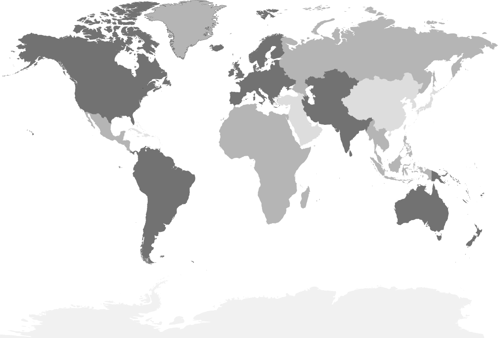

## A Postal Tale

</div>

<!-- What is the address of the DC in Mumbai -->

---

<!-- CHECKPOINT < 10:00 -->
<!-- Théo -->

<div class="flex vertical start">


</div>

<!-- Here is the guy who knows a guy -->

---

<!-- CHECKPOINT < 10:00 -->

<!-- Théo -->

<div class="flex vertical start">

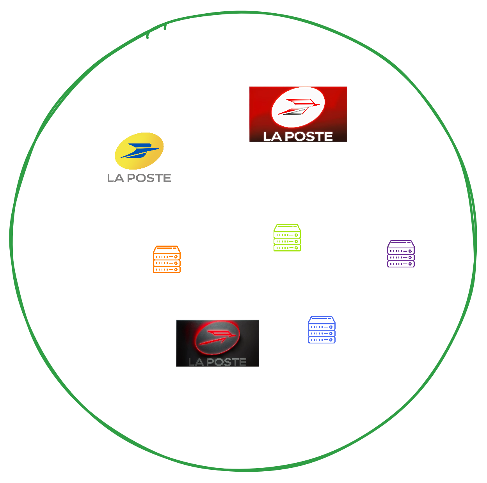

</div>

<!-- Here are some post offices -->
<!-- The Mumbai one is the one in the middle -->

---

<!-- CHECKPOINT < 10:00 -->
<!-- Théo -->

<div class="flex vertical start">

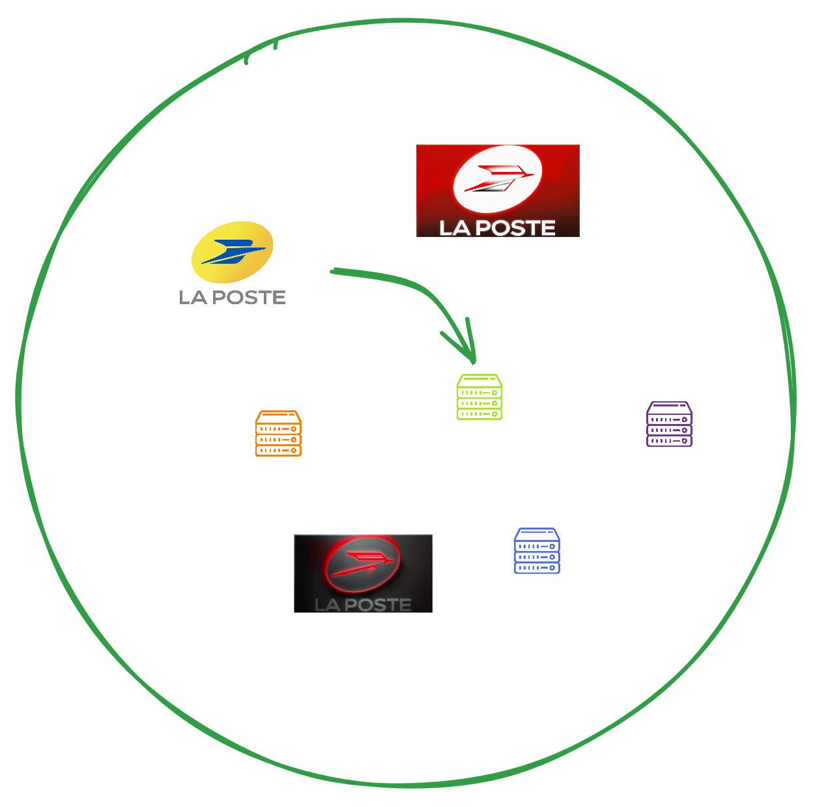

</div>

<!-- Each post office knows its neighborhood -->

---

<!-- CHECKPOINT < 10:00 -->
<!-- Théo -->

<div class="flex vertical start">

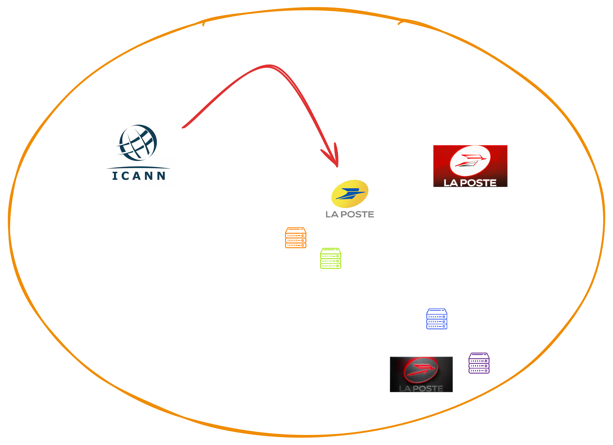

</div>

<!-- Ask your buddy -->
<!-- He says: I don't know, but I know where the post office is -->

---

<!-- CHECKPOINT < 10:00 -->
<!-- Théo -->

<div class="flex vertical start">

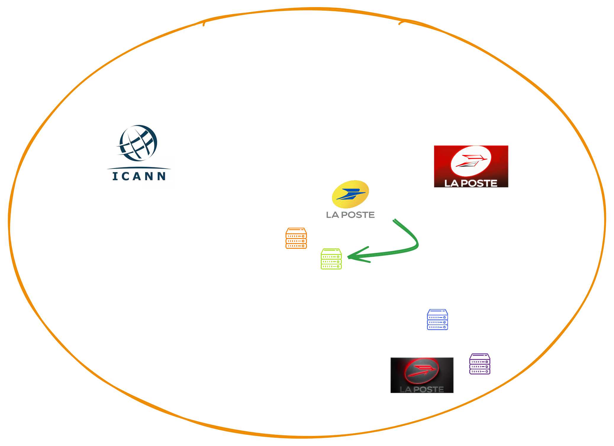

</div>

<!-- You go to the post office -->
<!-- I know where it is -->

---

<!-- CHECKPOINT < 10:00 -->
<!-- Théo -->

<div class="flex vertical start">

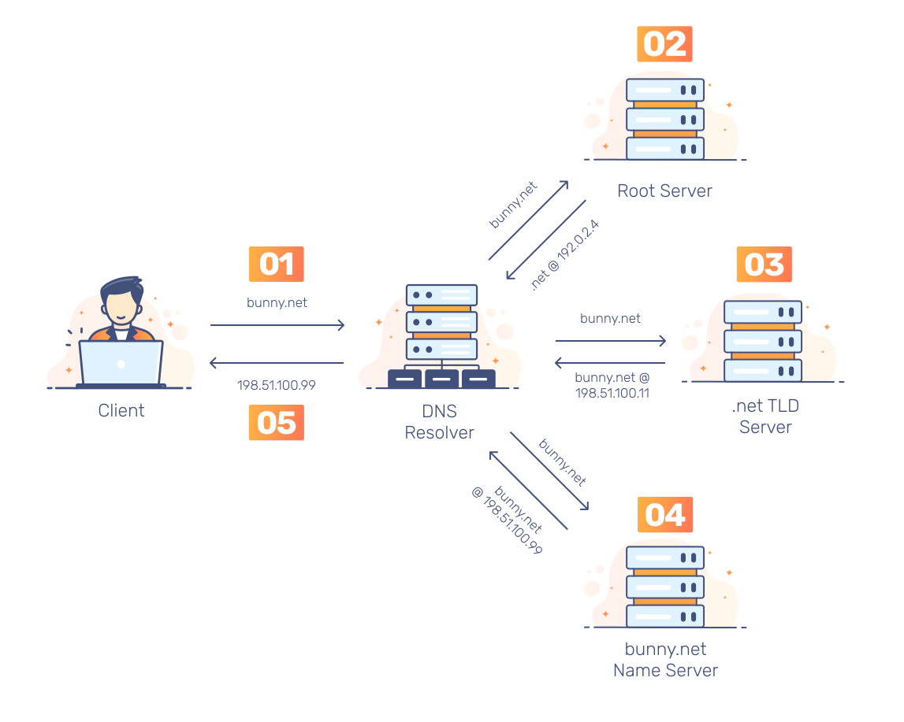

</div>

---

<!-- CHECKPOINT < 10:00 -->
<!-- Théo -->

<div class="flex vertical start">

## Zonefile

```txt
$ORIGIN example.com.
$TTL 3600
example.com.  IN  SOA   ns.example.com. username.example.com. ( 2020091025 7200 3600 1209600 3600 )

example.com.  IN  NS    ns
example.com.  IN  NS    ns.somewhere.example.
example.com.  IN  MX    10 mail.example.com.
@             IN  MX    20 mail2.example.com.
@             IN  MX    50 mail3
example.com.  IN  A     192.0.2.1
              IN  AAAA  2001:db8:10::1
ns            IN  A     192.0.2.2
              IN  AAAA  2001:db8:10::2
www           IN  CNAME example.com.
wwwtest       IN  CNAME www
mail          IN  A     192.0.2.3
mail2         IN  A     192.0.2.4
mail3         IN  A     192.0.2.5
```

</div>

<!-- This is an export of a dns zone -->
<!-- Zone is a database -->
<!-- Difference between IPv4 and IPv6 is GPS vs address -->
<!-- Both say the same thing -->

---

<!-- CHECKPOINT < 10:00 -->
<!-- Théo -->

<div class="flex vertical start">

## Quizz ❓🧭

- www.toto.fr ? 🔍

</div>

---

<!-- CHECKPOINT < 10:00 -->
<!-- Théo -->

<div class="flex vertical start">

## Quizz ❓🧭

- www.toto.fr ? 🔍
  DNS root 🌐 -> DNS fr 🇫🇷 -> DNS toto.fr ✅
- www.toto.gouv.fr ? 🏛️

</div>

---

<!-- CHECKPOINT < 10:00 -->
<!-- Théo -->

<div class="flex vertical start">

## Quizz ❓🧭

- www.toto.fr ? 🔍
  DNS root 🌐 -> DNS fr 🇫🇷 -> DNS toto.fr ✅
- www.toto.gouv.fr ? 🏛️
  DNS root 🌐 -> DNS fr 🇫🇷 -> DNS toto.gouv.fr ✅
- www.toto.notaires.fr ? 👩‍⚖️

</div>

---

<!-- CHECKPOINT < 10:00 -->
<!-- Théo -->

<div class="flex vertical start">

## Quizz ❓🧭

- www.toto.fr ? 🔍
  DNS root 🌐 -> DNS fr 🇫🇷 -> DNS toto.fr ✅
- www.toto.gouv.fr ? 🏛️
  DNS root 🌐 -> DNS fr 🇫🇷 -> DNS toto.gouv.fr ✅
- www.toto.notaires.fr ? 👩‍⚖️
  DNS root 🌐 -> DNS fr 🇫🇷 -> DNS notaires.fr 👩‍⚖️
  -> DNS toto.notaires.fr ✅

</div>

---

<!-- CHECKPOINT < 10:00 -->
<!-- Théo -->

<div class="flex vertical start">

## 🌐 Alternative Root

### 🆓 `.libre` / 🤓 `.geek`

```sh
~
❯ dig +short be.libre

~
❯ dig @94.247.43.254 +short be.libre
161.97.219.84
```

<div class="spacer"></div>

🔗 [opennic.org](https://opennic.org/)

</div>

---

<!-- CHECKPOINT < 10:00 -->
<!-- Théo -->

<div class="flex vertical start">

## 🧅 .onion

- 🫥 "Hidden" services on Tor network
- 🔒 Anonymous and secured
- 🚧 Not accessible through standard DNS software

<div class="spacer"></div>

🔗 [torproject.org](https://www.torproject.org/fr/download/)

</div>

---

<!-- CHECKPOINT < 10:00 -->

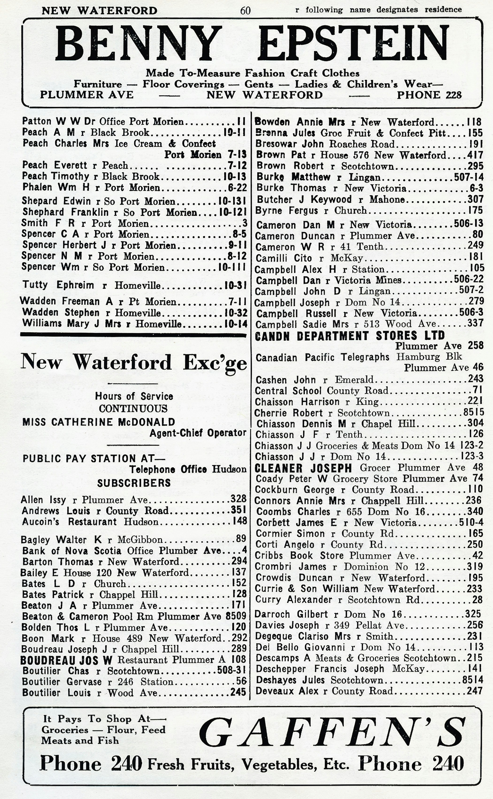

<!-- Photo from <a href="https://unsplash.com/fr/@portmorien">Port Morien Digital Archive</a> on <a href="https://unsplash.com/fr/photos/xPUzCnR_Vrw">Unsplash</a> -->

<div class="flex vertical space-around">

# 3. Whois/RDAP Directory

</div>

---

<!-- CHECKPOINT < 12:00 -->
<!-- Théo -->

<div class="flex vertical start">

<!-- Whois: né en 1982, protocole texte libre, utilisé pour connaître les infos d'un domaine -->
<!-- Obsolète (pas de sécurité, pas de structure), non conforme RGPD -->
<!-- Mort programmée en 2025 -->
<!-- RDAP le remplace: structuré, sécurisé, conforme, arrive en 2015, devient obligatoire en 2025 -->

## Whois 👶 1982 → ☠️ 2025

- 📝 Plain text
- 🤯 No standard keys definition

```txt
Domain Name: ovhcloud.com
Registrar: OVH, SAS
Registrar WHOIS Server: whois.ovh.com
Creation Date: 2011-11-24T14:49:05Z
Updated Date: 2024-03-27T11:12:22Z
Registrar Registration Expiration Date: 2032-11-24T14:49:05+01:00
Registrant Name: REDACTED FOR PRIVACY
Registry Registrant ID: REDACTED FOR PRIVACY
…
```

</div>

---

<!-- CHECKPOINT < 12:00 -->
<!-- Théo -->

<div class="flex vertical start">

## RDAP 🚀 2015 → ✅ 2025+

- 🧾 JSON + jCard with HTTPs
- 🕸️ Structured & machine-readable

<div class="spacer"></div>

🔗 <a href="https://client.rdap.org/?type=domain&object=ovhcloud.com" target="_blank">see ovhcloud.com RDAP</a>

</div>

---

<!-- CHECKPOINT < 12:00 -->


<!-- Photo from <a href="https://unsplash.com/fr/@kyleunderscorehead">Kyle Head</a> on <a href="https://unsplash.com/fr/photos/silhouette-de-trois-interprete
s-sur-scene-p6rNTdAPbuk">Unsplash</a> -->

<div class="flex vertical space-around">

# 4. Actors

</div>

---

<!-- CHECKPOINT < 14:00 -->

<div class="flex vertical start">

## Main Actors

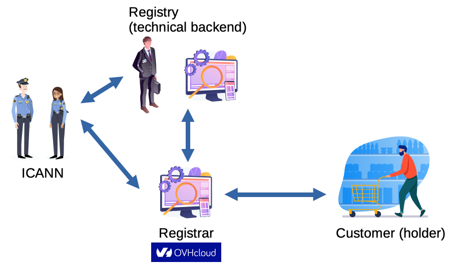

<!-- ICANN (Internet Corporation for Assigned Names and Numbers): créée en 1998, "indépendante" en 2016 -->

</div>

---

<!-- CHECKPOINT < 14:00 -->


<!-- Photo from <a href="https://unsplash.com/fr/@lemonvlad">Vladislav Klapin</a> on <a href="https://unsplash.com/fr/photos/pavillon-assorti-YeO44yVTl20">Unsplash</a> -->

<div class="flex vertical space-around">

# 5. Country-Codes TLDs (ccTLDs)

</div>

---

<!-- CHECKPOINT < 20:00 -->
<!-- Théo -->

<div class="flex vertical start">

## `tv` ?

</div>

---

<!-- CHECKPOINT < 20:00 -->
<!-- Théo -->

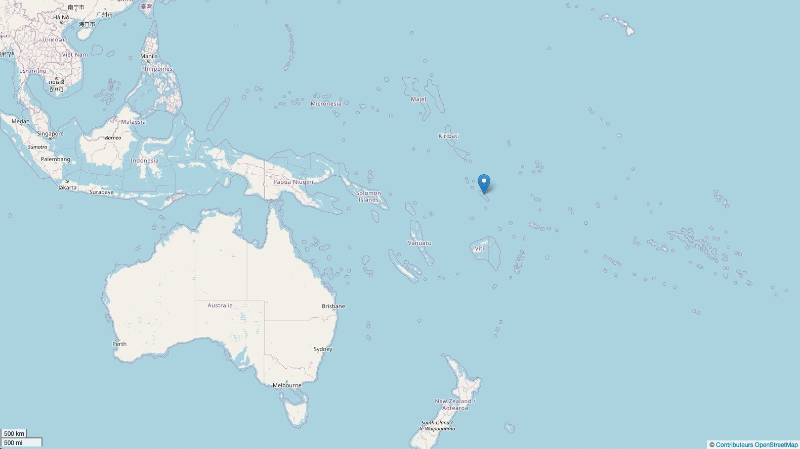

<!-- Source: https://www.openstreetmap.org/?mlat=-8.45&mlon=179.12#map=4/-8.45/179.12 -->

<div class="flex vertical start">

## `tv`: Tuvalu 🇹🇻

<!-- 5,56% du GDP -->

</div>

---

<!-- CHECKPOINT < 20:00 -->
<!-- Théo -->

<div class="flex vertical start">

## `ai` ?

</div>

---

<!-- CHECKPOINT < 20:00 -->
<!-- Théo -->

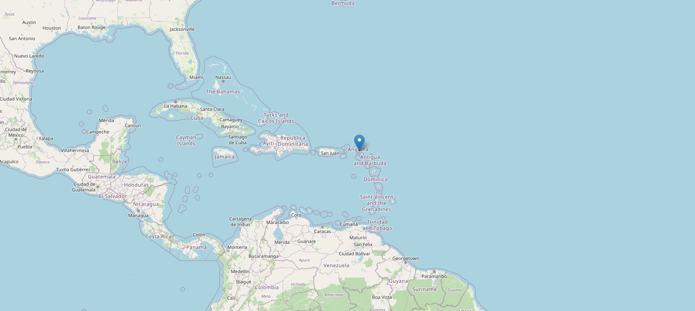

<!-- Source: https://www.openstreetmap.org/?mlat=18.22&mlon=-63.06#map=8/18.22/-63.06 -->

<div class="flex vertical start">

## `ai`: Anguilla 🇦🇮

<!-- 30 % du GDP -->
<!-- > 1 million de domaines, doubled in 1 year -->
<!-- 80$ / an -->

</div>

---

<!-- CHECKPOINT < 20:00 -->
<!-- Théo -->

<div class="flex vertical start">

## `yt` ?

</div>

---

<!-- CHECKPOINT < 20:00 -->
<!-- Théo -->

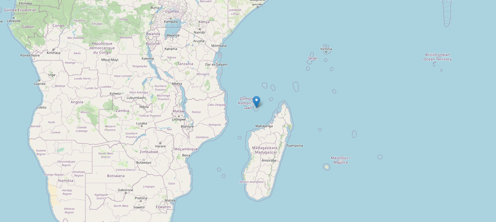

<!-- Source: https://www.openstreetmap.org/?mlat=-12.83&mlon=45.17#map=8/-12.83/45.17 -->

<div class="flex vertical start">

## `yt`: Mayotte 🇾🇹

</div>

---

<!-- CHECKPOINT < 20:00 -->
<!-- Théo -->

<div class="flex vertical start">

## `ly` ?

</div>

---

<!-- CHECKPOINT < 20:00 -->
<!-- Théo -->

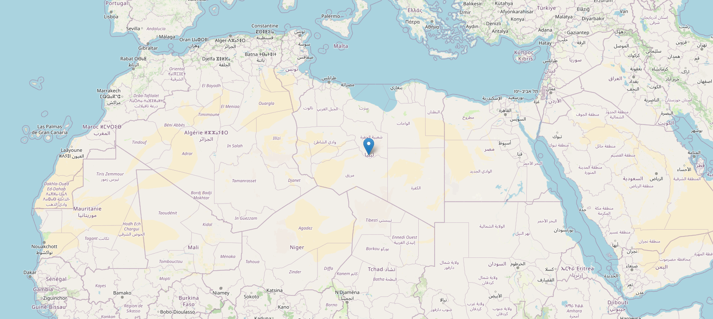

<!-- Source: https://www.openstreetmap.org/?mlat=26.34&mlon=17.23#map=5/26.34/17.23 -->

<div class="flex vertical start">

## `ly`: Libya 🇱🇾

</div>

<!-- 0,015% du PIB -->

---

<!-- CHECKPOINT < 20:00 -->
<!-- Théo -->

<div class="flex vertical start">

## `yu` ?

</div>

---

<!-- CHECKPOINT < 20:00 -->
<!-- Théo -->

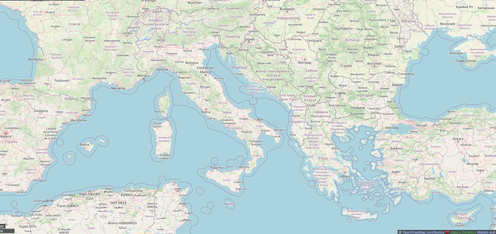

<!-- Source: https://www.openstreetmap.org/#map=6/41.80/16.08 -->

<div class="flex vertical start">

## `yu`: Yugoslavia

<!-- 1989: Création de l'extension en 1989 -->
<!-- 1991: Scission de la Yougoslavie en 1991 (Slovénie et Croatie deviennent indépendantes) -->
<!-- 1991 (fin): début de l'exploitation de l'extension .yu -->
<!-- 1992: des agents slovènes volent la base de données et détruisent l'extension -->
<!-- 1994: La Serbie reprend la gestion de l'extension .yu -->
<!-- 2002: l'extension n'est plus commercialisée (.rs privilégié pour la Serbie) -->
<!-- 2010: suppression définitive, 4 000 domaines détruits -->

</div>

---

<!-- CHECKPOINT < 20:00 -->


<!-- Photo from <a href="https://unsplash.com/fr/@carl_wang">Carl Wang</a> on <a href="https://unsplash.com/fr/photos/une-vue-de-la-terre-depuis-lespace-OCe8cTGymSQ">Unsplash</a> -->

<div class="flex vertical space-around">

# 6. Generic TLDs (gTLDs)

</div>

---

<!-- CHECKPOINT < 28:00 -->

<div class="flex vertical start">

## First gTLDs

- **1985**: com, net, org, edu, gov, mil, int
- **2000**: aero, biz, coop, info, museum, name, pro
- **2004**: asia, cat, jobs, mobi, tel, travel

<!-- less than 20 extensions for a long time, over 3000 now -->

</div>

---

<!-- CHECKPOINT < 28:00 -->

<div class="flex vertical start">

## New gTLDs (2012)

<div class="horizontal start">

- Application fees
  **$ 185 000**
- Process  ➡️

<div class="hspacer"></div>


<!-- Source: https://newgtlds.icann.org/en/applicants/agb / https://archive.icann.org/fr/topics/new-gtlds/intro-redline-12nov10-fr.pdf -->
</div>

</div>

---

<!-- CHECKPOINT < 28:00 -->

<div class="flex vertical start">

## Last Delegations


<!-- Source: https://newgtlds.icann.org/en/program-status/delegated-strings -->

- Example: `mobile` delegated end of 2016, GA February 2026
  <!-- https://domainnamewire.com/2026/02/04/mobile-domain-names-become-available-today/ -->

</div>

---

<!-- CHECKPOINT < 28:00 -->

<div class="flex vertical start">

## International Extensions

<div class="horizontal start">

- `paris`
- `bzh`
- `africa`

<div class="hspacer"></div>

- `عرب` (Arab)
- `中国` (China)
- `コム` (Japan)

</div>

---

<!-- CHECKPOINT < 28:00 -->
<!-- Théo -->

<!-- _backgroundColor: darkslategray -->

<div class="flex vertical start">

## Internal Company Usage

- `google` 🔗 <a href="https://blog.google" target="_blank">blog.google</a>
- `leclerc` 🔗 <a href="https://location.leclerc" target="_blank">location.leclerc</a>
- `cuisinella` 🔗 <a href="https://www.ma.cuisinella" target="_blank">www.ma.cuisinella</a>

</div>

---

<!-- CHECKPOINT < 28:00 -->

<div class="flex vertical start">

## Public Usage

- `ovh`

</div>

---

<!-- CHECKPOINT < 28:00 -->
<!-- Théo -->

<!-- _backgroundColor: darkslategray -->

<div class="flex vertical start">

## Constrained Extensions

- `dev`, `app` (mandatory HTTPS)
  ⇒ Enforced by modern browsers

</div>

---

<!-- CHECKPOINT < 28:00 -->

## Business Model

<div class="flex vertical start">

<!-- "extortion" -->

- `sucks`

</div>

---

<!-- CHECKPOINT < 28:00 -->
<!-- Théo -->

<!-- _backgroundColor: darkslategray -->

## Reserved Extensions

<div class="flex vertical start">

- `example` / `local` / `invalid` (not routed)
- `corp` / `home` (applications refused)

<!-- Liste complète: https://www.iana.org/assignments/special-use-domain-names/special-use-domain-names.xhtml -->

</div>

---

<!-- CHECKPOINT < 28:00 -->

## Conflicts

<div class="flex vertical start">

- 🍷🍾 [`wine`](https://www.larvf.com/,vin-internet-nom-wine-lancement-donuts-domaine,4477645.asp)

</div>

---

<!-- CHECKPOINT < 28:00 -->

<!-- _backgroundColor: darkslategray -->

## Conflicts

<div class="flex vertical start">

- 🍷🍾 [`wine`](https://www.larvf.com/,vin-internet-nom-wine-lancement-donuts-domaine,4477645.asp): delegated in 2015 ✅
- 🌳🌴 [`amazon`](https://archive.wikiwix.com/cache/?url=https%3A%2F%2Fwww.bna.com%2Famazon-internet-domain-b73014471531%2F)

</div>

---

<!-- CHECKPOINT < 28:00 -->

## Conflicts

<div class="flex vertical start">

- 🍷🍾 [`wine`](https://www.larvf.com/,vin-internet-nom-wine-lancement-donuts-domaine,4477645.asp): delegated in 2015 ✅
- 🌳🌴 [`amazon`](https://archive.wikiwix.com/cache/?url=https%3A%2F%2Fwww.bna.com%2Famazon-internet-domain-b73014471531%2F): delegated in 2020 ✅
- 🌎🕸️ [`web`](https://domainincite.com/27950-verisign-and-afilias-spar-over-web-delays)

</div>

---

<!-- CHECKPOINT < 28:00 -->

## Conflits

<div class="flex vertical start">

- 🍷🍾 [`wine`](https://www.larvf.com/,vin-internet-nom-wine-lancement-donuts-domaine,4477645.asp): delegated in 2015 ✅
- 🌳🌴 [`amazon`](https://archive.wikiwix.com/cache/?url=https%3A%2F%2Fwww.bna.com%2Famazon-internet-domain-b73014471531%2F): delegated in 2020 ✅
- 🌎🕸️ [`web`](https://domainincite.com/tag/web): case still not solved! ❌

<!--

### Histoire du `web`

- https://domainincite.com/tag/web
- https://domainincite.com/23758-verisign-says-afilias-tried-to-rig-web-auction
- https://domainincite.com/26737-web-ruling-hands-afilias-a-chance-verisign-a-problem-and-icann-its-own-ass-on-a-plate

  > The case came about due to a dispute about the .web auction, which was run by ICANN in July 2016.
  >
  > Six of the seven .web applicants had been keen for the contention set to be settled privately, in an auction that would have seen the winning bid distributed evenly among the losing bidders.
  >
  > But Nu Dot Co (NDC), an application vehicle not known to be particularly well-funded, held out for a “last resort” auction, in which the winning bid would be deposited directly into ICANN’s coffers.
  >
  > This raised suspicions that NDC [had a secret sugar daddy](http://domainincite.com/20748-is-verisign-web-applicants-secret-sugar-daddy), likely Verisign, that was covertly bankrolling its bid.
  >
  > It was not known until after NDC won, [with a $135 million bid](http://domainincite.com/20820-verisign-likely-135-million-winner-of-web-gtld), that these suspicions were correct. NDC and Verisign had a “Domain Acquisition Agreement” or DAA that would see NDC transfer its .web contract to Verisign in exchange for the money needed to win the auction (and presumably other considerations, though almost all references to the terms of the DAA have been redacted by ICANN throughout the IRP).
  >
  > Afilias and fellow .web applicant Donuts both approached ICANN before and after the auction, complaining that the NDC/Verisign bid was bogus, in violation of program rules requiring applicants to notify ICANN if there’s any change of control of their applications, including agreements to transfer the gTLD post-contracting.

- https://domainincite.com/28757-verisign-will-get-web-icann-rules: Icann dit que c'est OK
- https://domainincite.com/28948-web-hit-by-second-icann-complaint / https://domainincite.com/29159-web-fight-back-in-court / https://domainnamewire.com/2023/05/16/web-may-face-more-delays-as-altanovo-fights-on/: Afilias re-conteste

-->

</div>

---

<!-- CHECKPOINT < 28:00 -->
<!-- Théo -->

<div class="flex vertical start">

## Round Sumup

- **2 000** applications received <!-- https://newgtlds.icann.org/en/program-status/statistics -->
  - 1 400 different extensions <!-- https://icannwiki.org/New_gTLD_Program_(2012) -->
- 1 200 extensions approved (delegated) <!-- https://gtldresult.icann.org/applicationstatus/viewstatus -->
- **1 108** extensions enabled (55%) <!-- https://www.ntldstats.com/tld -->

</div>

---

<!-- CHECKPOINT < 28:00 -->
<!-- Théo -->

<div class="flex vertical start">

### gTLD Adoption (2026)

| Extension   | Registered Domains | % of the round |
| ----------- | ------------------ | -------------- |
| **.xyz**    | 9,937,920          | 14%            |
| **.top**    | 8,359,616          | 12%            |
| **.shop**   | 5,665,110          | 8%             |
| **.online** | 4,930,765          | 7%             |

</div>

---

<!-- CHECKPOINT < 28:00 -->
<!-- Théo -->

<div class="flex vertical start">

### gTLD Adoption (2026)

| Extension   | Registered Domains | % of the round |
| ----------- | ------------------ | -------------- |
| **.xyz**    | 9,937,920          | 14%            |
| **.top**    | 8,359,616          | 12%            |
| **.shop**   | 5,665,110          | 8%             |
| **.online** | 4,930,765          | 7%             |
|             |                    |                |
| _.com_ 🌍   | ~ 309,971,407      |                |
| _.cn_ 🇨🇳    | ~ 37,690,649       |                |
| _\*_        | ~ 836,632,916      |                |

<!-- https://www.ntldstats.com/tld/ -->
<!-- https://domainnamestat.com/statistics/overview -->

<!-- plus ou moins le meme nombre que le .io ou .ai -->

</div>

---

<!-- CHECKPOINT < 28:00 -->
<!-- Théo -->

<div class="flex vertical start">

## Highest gTLD Auctions 💰

| Extension | Price         | Winning Candidate |
| --------- | ------------- | ----------------- |
| **.TECH** | $ 6,760,000   | Dot Tech          |
| **.BLOG** | $ 8,000,000   | Automattic        |
| **.APP**  | $ 25,001,000  | Google            |
| **.SHOP** | $ 41,500,000  | GMO Registry      |
| **.WEB**  | $ 135,000,000 | Verisign          |

<!-- témoignage Radix: https://domainincite.com/28352-interview-sandeep-ramchandani-on-10-years-of-radix-and-new-gtlds -->

</div>

---

<!-- CHECKPOINT < 28:00 -->


<!-- Photo from <a href="https://unsplash.com/fr/@simonesecci">Simone Secci</a> on <a href="https://unsplash.com/fr/photos/lettres-rouges-neon-49uySSA678U">Unsplash</a> -->

<div class="flex vertical space-around">

# 7. New gTLDs Round

</div>

---

<!-- CHECKPOINT < 30:00 -->

<div class="flex vertical start">

## Process

<!-- Infos : https://newgtldprogram.icann.org/en/resources/ChampionsToolkit -->
<!-- Dates : https://domainincite.com/31571-icann-maps-out-new-gtld-timeline -->

- **Pre-requisite**: Long-term vision
- 🗓️ Starting **April 30th 2026**, for ~3 months
  - 💰 **$ 227 000** + **$ 92 000** (technical backend)
  - 🔨 internal/external auctions? [Ongoing RFI](https://www.icann.org/fr/announcements/details/icann-rfi-new-gtld-program-next-round-auctions-18-08-2025-fr)

</div>

---

<!-- CHECKPOINT < 30:00 -->

<div class="flex vertical start">

## Perspectives

- 👫 **Individuals**: not much
- 🏢 **Requesters**:
  - guarantee brand authenticity (`.ovhcloud`?)
  - secure institutional websites
  - sell to international brands
- 🔄 Start of a new era of on-the-fly applications (?)

</div>

---


<!-- Photo from <a href="https://unsplash.com/fr/@impatrickt">Patrick Tomasso</a> on <a href="https://unsplash.com/fr/photos/ampoules-vintage-allumees-1NTFSnV-KLs">Unsplash</a> -->

<div class="flex vertical space-around">

# 8. Other Trends

</div>

---

<!-- CHECKPOINT < 50:00 -->
<!-- Théo -->

<div class="flex vertical start">

## #NotEnoughTime

- 🛍️ Aftermarket
  <!-- SEDO / Afternic -->
  <!-- 70M$ pour ai.com en 2025: https://domainincite.com/31543-ai-com-the-most-expensive-domain-sale-ever -->
- 🔐 NFT / Web 3: `.eth` -> `web3.js`
  <!-- basé sur les smart contract -->
- ⚔️ Incoming battle: `.agi`
  <!-- artificial general intelligence -->
  <!--https://domainincite.com/31315-ai-rival-lines-up-gtld-bid-->
  <!--https://unstoppabledomains.com/blog/categories/announcements/article/agi-tld-->

</div>

---


<!-- Photo from <a href="https://unsplash.com/fr/@simonesecci">Simone Secci</a> on <a href="https://unsplash.com/fr/photos/lettres-rouges-neon-49uySSA678U">Unsplash</a> -->

<div class="flex vertical space-between">

# Questions

<div class="horizontal space-between bottom-align">

<div class="footnotes">

Image Credits: [Unsplash](https://unsplash.com) and [Freepik](https://www.freepik.com)
Slides: [https://github.com/Preovaleo/talk-extensions](https://https://github.com/Preovaleo/talk-extensions/)

</div>

</div>
