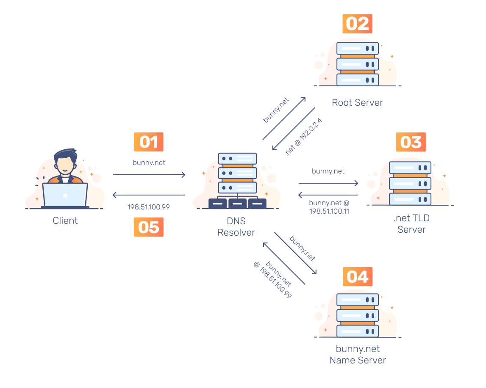
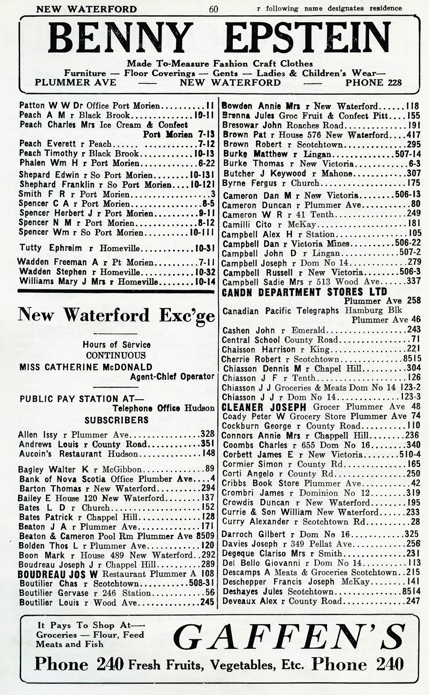
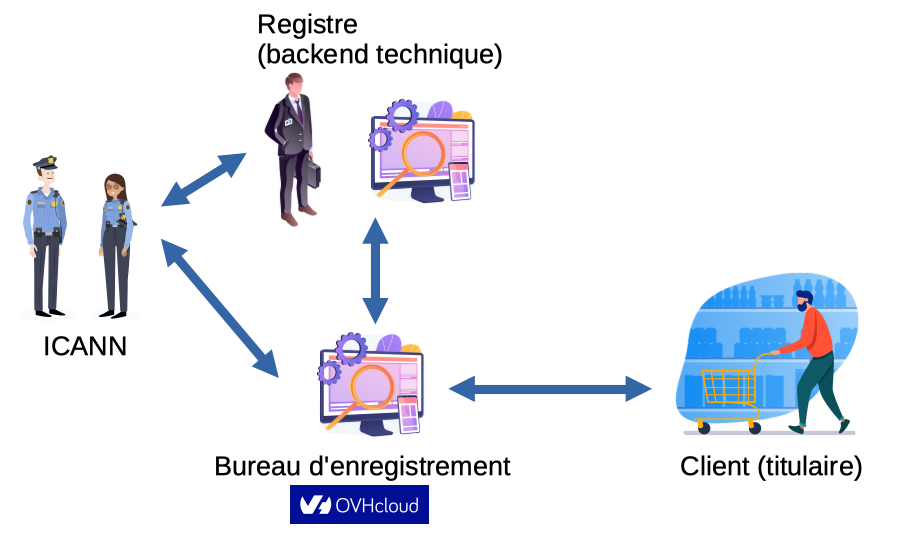

<!-- markdownlint-disable MD001 MD026 MD033 MD045 -->

<!-- Compile to HTML with `marp -w -s --html true .`
     (if it raises a watch error, disable git FS monitoring first with `git config core.fsmonitor false`) -->

<!-- https://marpit.marp.app/markdown -->

<style>
    @import url('./slide-deck.css');
</style>

<div class="flex vertical center">


<!-- Photo de <a href="https://unsplash.com/fr/@choys_">Conny Schneider</a> sur <a href="https://unsplash.com/fr/photos/a-blue-background-with-lines-and-dots-xuTJZ7uD7PI">Unsplash</a> -->

# La grande histoire

## des petites **extensions**

### de **noms de domaines**

<div class="spacer"></div>

Théo Bougé & Benoît Masson – OVHcloud

</div>

---

<div class="flex vertical space-between">

## Qui sommes-nous ?

<div class="horizontal space-around">

<div class="vertical start">

### Théo


SRE Domaines

</div>
<div class="vertical start">

### Benoît


Développeur Domaines

</div>

</div>


</div>

---


<!-- Photo de <a href="https://unsplash.com/fr/@joshua_hoehne">Joshua Hoehne</a> sur <a href="https://unsplash.com/fr/photos/papier-dimprimante-blanc-avec-texte-noir-1UDjq8s8cy0">Unsplash</a> -->

<div class="flex vertical space-around">

# 1. Noms de domaines et extensions

</div>

---

<div class="flex vertical start">

## Nom de domaine

URL : `https://www.ovhcloud.com:8080/mail`

</div>

---

<div class="flex vertical start">

## Nom de domaine

URL : `https://www.ovhcloud.com:8080/mail`

- `https` : protocole
- `www` : nom d'hôte (machine) / sous-domaine
- `ovhcloud.com` : **nom de domaine**
  - `ovhcloud` : étiquette / `com` : extension
- `8080` : port
- `/mail` : chemin d'accès

</div>

---

<div class="flex vertical start">

## Quizz : quelle est l'extension ?

- `toto.fr`

</div>

---

<div class="flex vertical start">

## Quizz : quelle est l'extension ?

- `toto.fr` => `fr`
- `com.toto.fr`

</div>

---

<div class="flex vertical start">

## Quizz : quelle est l'extension ?

- `toto.fr` => `fr`
- `com.toto.fr` => `fr`
- `toto.gouv.fr`

</div>

---

<div class="flex vertical start">

## Quizz : quelle est l'extension ?

- `toto.fr` => `fr`
- `com.toto.fr` => `fr`
- `toto.gouv.fr` => `gouv.fr`
- `toto.com.fr`

</div>

---

<div class="flex vertical start">

## Quizz : quelle est l'extension ?

- `toto.fr` => `fr`
- `com.toto.fr` => `fr`
- `toto.gouv.fr` => `gouv.fr`
- `toto.com.fr` => `com.fr`
- `toto.fr.com`

</div>

---

<div class="flex vertical start">

## Quizz : quelle est l'extension ?

- `toto.fr` => `fr`
- `com.toto.fr` => `fr`
- `toto.gouv.fr` => `gouv.fr`
- `toto.com.fr` => `com.fr`
- `toto.fr.com` => `com`
- `toto.notaires.fr`

</div>

---

<div class="flex vertical start">

## Quizz : quelle est l'extension ?

- `toto.fr` => `fr`
- `com.toto.fr` => `fr`
- `toto.gouv.fr` => `gouv.fr`
- `toto.com.fr` => `com.fr`
- `toto.fr.com` => `com`
- `toto.notaires.fr` => `fr`

</div>

---

<div class="flex vertical start">

## Types d'extensions (1)

- **TLD** (Top-Level Domain)
- SLD (Second-Level Domain)
- 3LD (Third-Level Domain)

<div class="spacer"></div>

Liste publique (_non officielle_) sur https://publicsuffix.org/list/

</div>

---

<div class="flex vertical start">

## Types d'extensions (2)

- **ccTLD** (Country-Code TLD)
- **gTLD** (Generic TLD)

</div>

---

<div class="flex vertical start">

## Quizz : ccTLD 🏳️‍🌈 ou gTLD 🌍 ?

<div class="horizontal start">

- `fr`

</div>

---

<div class="flex vertical start">

## Quizz : ccTLD 🏳️‍🌈 ou gTLD 🌍 ?

<div class="horizontal start">

- `fr` => 🇫🇷
- `com`

</div>

---

<div class="flex vertical start">

## Quizz : ccTLD 🏳️‍🌈 ou gTLD 🌍 ?

<div class="horizontal start">

- `fr` => 🇫🇷
- `com` => 🌍
- `co`

</div>

---

<div class="flex vertical start">

## Quizz : ccTLD 🏳️‍🌈 ou gTLD 🌍 ?

<div class="horizontal start">

- `fr` => 🇫🇷
- `com` => 🌍
- `co` => 🇨🇴
- `gouv.fr`

</div>

---

<div class="flex vertical start">

## Quizz : ccTLD 🏳️‍🌈 ou gTLD 🌍 ?

<div class="horizontal start">

- `fr` => 🇫🇷
- `com` => 🌍
- `co` => 🇨🇴
- `gouv.fr` => 🇫🇷
- `bzh`

</div>

---

<div class="flex vertical start">

## Quizz : ccTLD 🏳️‍🌈 ou gTLD 🌍 ?

<div class="horizontal start">

- `fr` => 🇫🇷
- `com` => 🌍
- `co` => 🇨🇴
- `gouv.fr` => 🇫🇷
- `bzh` => 🌍
- `eu`

</div>

---

<div class="flex vertical start">

## Quizz : ccTLD 🏳️‍🌈 ou gTLD 🌍 ?

<div class="horizontal start">

- `fr` => 🇫🇷
- `com` => 🌍
- `co` => 🇨🇴
- `gouv.fr` => 🇫🇷
- `bzh` => 🌍
- `eu` => 🇪🇺

<div class="hspacer"></div>

- `ευ`

</div>

</div>

---

<div class="flex vertical start">

## Quizz : ccTLD 🏳️‍🌈 ou gTLD 🌍 ?

<div class="horizontal start">

- `fr` => 🇫🇷
- `com` => 🌍
- `co` => 🇨🇴
- `gouv.fr` => 🇫🇷
- `bzh` => 🌍
- `eu` => 🇪🇺

<div class="hspacer"></div>

- `ευ` => 🇪🇺
- `asia`

</div>

</div>

---

<div class="flex vertical start">

## Quizz : ccTLD 🏳️‍🌈 ou gTLD 🌍 ?

<div class="horizontal start">

- `fr` => 🇫🇷
- `com` => 🌍
- `co` => 🇨🇴
- `gouv.fr` => 🇫🇷
- `bzh` => 🌍
- `eu` => 🇪🇺

<div class="hspacer"></div>

- `ευ` => 🇪🇺
- `asia` => 🌍
- `dev`

</div>

</div>

---

<div class="flex vertical start">

## Quizz : ccTLD 🏳️‍🌈 ou gTLD 🌍 ?

<div class="horizontal start">

- `fr` => 🇫🇷
- `com` => 🌍
- `co` => 🇨🇴
- `gouv.fr` => 🇫🇷
- `bzh` => 🌍
- `eu` => 🇪🇺

<div class="hspacer"></div>

- `ευ` => 🇪🇺
- `asia` => 🌍
- `dev` => 🌍
- `ai`

</div>

</div>

---

<div class="flex vertical start">

## Quizz : ccTLD 🏳️‍🌈 ou gTLD 🌍 ?

<div class="horizontal start">

- `fr` => 🇫🇷
- `com` => 🌍
- `co` => 🇨🇴
- `gouv.fr` => 🇫🇷
- `bzh` => 🌍
- `eu` => 🇪🇺

<div class="hspacer"></div>

- `ευ` => 🇪🇺
- `asia` => 🌍
- `dev` => 🌍
- `ai` => 🇦🇮
- `tv`

</div>

</div>

---

<div class="flex vertical start">

## Quizz : ccTLD 🏳️‍🌈 ou gTLD 🌍 ?

<div class="horizontal start">

- `fr` => 🇫🇷
- `com` => 🌍
- `co` => 🇨🇴
- `gouv.fr` => 🇫🇷
- `bzh` => 🌍
- `eu` => 🇪🇺

<div class="hspacer"></div>

- `ευ` => 🇪🇺
- `asia` => 🌍
- `dev` => 🌍
- `ai` => 🇦🇮
- `tv` => 🇹🇻
- `radio`

</div>

---

<div class="flex vertical start">

## Quizz : ccTLD 🏳️‍🌈 ou gTLD 🌍 ?

<div class="horizontal start">

- `fr` => 🇫🇷
- `com` => 🌍
- `co` => 🇨🇴
- `gouv.fr` => 🇫🇷
- `bzh` => 🌍
- `eu` => 🇪🇺

<div class="hspacer"></div>

- `ευ` => 🇪🇺
- `asia` => 🌍
- `dev` => 🌍
- `ai` => 🇦🇮
- `tv` => 🇹🇻
- `radio` => 🌍

</div>

</div>

---

<div class="flex vertical start">

## Caractères spéciaux (non-ASCII)

- **IDN** (International Domain Name) depuis 2003

  - pour l'extension et/ou l'étiquette

- Conversion avec l'encodage _Punycode_
  - `ευ` <=> `xn--qxa6a`

</div>

---


<!-- Photo de <a href="https://unsplash.com/fr/@j_harris_391">Joshua Harris</a> sur <a href="https://unsplash.com/fr/photos/un-poteau-avec-un-tas-de-panneaux-de-signalisation-jaunes-dessus-BwH31YGYXho">Unsplash</a> -->

<div class="flex vertical space-around">

# 2. DNS

</div>

---

<div class="flex vertical start">

## DNS (Théo)



</div>

---

<div class="flex vertical start">

## Record DNS

- TXT
- A / AAAA
- NS
- MX
- CNAME / DNAME
- DNSKEY

</div>

---

<div class="flex vertical start">

## Quizz ❓🧭

- www.toto.fr ? 🔍

</div>

---

<div class="flex vertical start">

## Quizz ❓🧭

- www.toto.fr ? 🔍
  DNS root 🌐 -> DNS fr 🇫🇷 -> DNS toto.fr ✅  
- toto.gouv.fr ? 🏛️

</div>

---

<div class="flex vertical start">

## Quizz ❓🧭

- www.toto.fr ?  🔍
  DNS root 🌐 -> DNS fr 🇫🇷 -> DNS toto.fr ✅  
- www.toto.gouv.fr ? 🏛️  
  DNS root 🌐 -> DNS fr 🇫🇷 -> DNS toto.gouv.fr ✅  
- www.toto.notaires.fr ? 👩‍⚖️

</div>

---

<div class="flex vertical start">

## Quizz ❓🧭

- www.toto.gouv.fr ? 🏛️  
  DNS root 🌐 -> DNS fr 🇫🇷 -> DNS toto.gouv.fr ✅  
- www.toto.notaires.fr ? 👩‍⚖️  
  DNS root 🌐 -> DNS fr 🇫🇷 -> DNS notaires.fr 👩‍⚖️ 
-> DNS toto.notaires.fr ✅  
- toto.co.uk ? 🇬🇧

</div>

---

<div class="flex vertical start">

## Quizz ❓🧭

- www.toto.notaires.fr ? 👩‍⚖️  
  DNS root 🌐 -> DNS fr 🇫🇷 -> DNS notaires.fr 👩‍⚖️ 
  -> DNS toto.notaires.fr ✅  
- toto.co.uk ? 🇬🇧  
  DNS root 🌐 -> DNS uk 🇬🇧 -> DNS toto.co.uk ✅

</div>


---

<div class="flex vertical start">

## Les DNS racines alternatifs

### https://opennic.org/

```sh
~
❯ dig +short be.libre

~
❯ dig @94.247.43.254 +short be.libre
161.97.219.84

```

### .onion

https://www.torproject.org/fr/download/

</div>

---



<!-- Photo de <a href="https://unsplash.com/fr/@portmorien">Port Morien Digital Archive</a> sur <a href="https://unsplash.com/fr/photos/xPUzCnR_Vrw">Unsplash</a> -->

<div class="flex vertical space-around">

# 3. Annuaire Whois/RDAP

</div>

---

<div class="flex vertical start">

<!-- Whois : né en 1982, protocole texte libre, utilisé pour connaître les infos d'un domaine -->
<!-- Obsolète (pas de sécurité, pas de structure), non conforme RGPD -->
<!-- Mort programmée en 2025 -->
<!-- RDAP le remplace : structuré, sécurisé, conforme, arrive en 2015, devient obligatoire en 2025 -->

## Whois 👶 1982 → ☠️ 2025  
📝 texte libre,  
pas de standard pour les clés ni le contenu

```txt
domain:                        adatechschool.fr
status:                        ACTIVE
eppstatus:                     active
hold:                          NO
Expiry Date:                   2026-02-15T14:32:02Z
created:                       2019-02-15T14:32:02Z
nic-hdl:                       ANO00-FRNIC
type:                          PERSON
contact:                       Ano Nymous
nserver:                       dns110.ovh.net
nserver:                       ns110.ovh.net
```

</div>

---

<div class="flex vertical start">

## RDAP 🚀 2015 → ✅ 2025+  
🧾 JSON + jCard via HTTPs
structuré, machine-readable, 

🔗 [Voir RDAP pour adatechschool.fr](https://client.rdap.org/?type=domain&object=adatechschool.fr)

</div>


---

<div class="flex vertical start">

## Principaux acteurs



<!-- ICANN (Internet Corporation for Assigned Names and Numbers) : créée en 1998, "indépendante" en 2016 -->

</div>

---

<div class="flex vertical start">

## Autres acteurs

- 🗂️ Dépositaire des données
- 👨‍👦‍👦 Bureau d'enregistrement _proxy_

</div>

---

<div class="flex vertical start">

## Autres acteurs

- 🗂️ Dépositaire des données
- 👨‍👦‍👦 Bureau d'enregistrement _proxy_
- 🏴‍☠️ Spammer, phisher
- 💰 Domainer

</div>

---


<!-- Photo de <a href="https://unsplash.com/fr/@lemonvlad">Vladislav Klapin</a> sur <a href="https://unsplash.com/fr/photos/pavillon-assorti-YeO44yVTl20">Unsplash</a> -->

<div class="flex vertical space-around">

# 5. Country-Codes TLDs (ccTLDs)

</div>

<!-- Je te proposerais bien d'afficher pour chacun son drapeau (emoji) + en background, sa position sur la carte du monde
     (par ex. 🇹🇻 + screenshot de https://www.openstreetmap.org/?mlat=-8.45&mlon=179.12#map=4/-8.45/179.12 pour Tuvalu (tv)
     Je te mets l'exemple ci-dessous, fais-en ce que tu veux -->

---

<div class="flex vertical start">

## `tv` ?

</div>

---


<!-- Source : https://www.openstreetmap.org/?mlat=-8.45&mlon=179.12#map=4/-8.45/179.12 -->

<div class="flex vertical start">

## `tv` : Tuvalu 🇹🇻

</div>

---

<div class="flex vertical start">

## ccTLDs (Théo)

**quizz** pays correspondant ?

- tv, ai, yt
- ly, io
- af
- hr

</div>

---


<!-- Photo de <a href="https://unsplash.com/fr/@carl_wang">Carl Wang</a> sur <a href="https://unsplash.com/fr/photos/une-vue-de-la-terre-depuis-lespace-OCe8cTGymSQ">Unsplash</a> -->

<div class="flex vertical space-around">

# 6. Generic TLDs (gTLDs)

</div>

---

<div class="flex vertical start">

## Les premiers gTLDs

- **1985** : com, net, org, edu, gov, mil, int
- **2000** : aero, biz, coop, info, museum, name, pro
- **2004** : asia, cat, jobs, mobi, tel, travel

</div>

---

<div class="flex vertical start">

## Nouveaux gTLDs (2012)

<div class="horizontal start">

- Frais de dossier
  **185 000$**
- Processus ➡️

<div class="hspacer"></div>


<!-- Source : https://newgtlds.icann.org/en/applicants/agb / https://archive.icann.org/fr/topics/new-gtlds/intro-redline-12nov10-fr.pdf -->
</div>

</div>

---

<div class="flex vertical start">

## Nouveaux gTLDs (2012)

<div class="horizontal start">

- Frais de dossier
  **185 000$**
- Processus ➡️
  (si conflits)

<div class="hspacer"></div>


<!-- Source : https://newgtlds.icann.org/en/applicants/agb / https://archive.icann.org/fr/topics/new-gtlds/intro-redline-12nov10-fr.pdf -->
</div>

</div>

---

<div class="flex vertical start">

## Dernières validations


<!-- Source : https://newgtlds.icann.org/en/program-status/delegated-strings -->

- Exemple : `yun` validé 2016, ouvre fin octobre 2025
  <!-- https://domainincite.com/31303-cloud-gtld-gets-launch-dates -->

</div>

---

<div class="flex vertical start">

## Extensions internationales

<div class="horizontal start">

- `paris`
- `bzh`
- `asia`

<div class="hspacer"></div>

- `عرب` <!-- Arab -->
- `中国` <!-- China -->
- `コム` <!-- Japan -->
- `католик` <!-- catholic -->

</div>

---

<!-- _backgroundColor: darkslategray -->

<div class="flex vertical start">

## Extensions d'entreprise

### (usage interne)

- T `leclerc` / `cuisinella` (entreprises, usage interne)

</div>

---

<div class="flex vertical start">

## Extensions d'entreprise

### (vente publique)

- `ovh`

</div>

---

<!-- _backgroundColor: darkslategray -->

<div class="flex vertical start">

## Extensions supprimées

- T `sncf` / `goodyear` (plus utilisés / supprimés)

</div>

---

<div class="flex vertical start">

## Extensions avec contraintes

- `dev`, `app` (HTTPS obligatoire)

</div>

---

<!-- _backgroundColor: darkslategray -->

## Tarification

<div class="flex vertical start">

- T `security`, `auto` (cher)

</div>

---

## Business model

<div class="flex vertical start">

- `sucks`

</div>

---

<!-- _backgroundColor: darkslategray -->

## Extensions réservées

<div class="flex vertical start">

- T `example` / `local` (non routés) + `corp` / `home` (dossiers refusés)

<!-- Liste complète : https://www.iana.org/assignments/special-use-domain-names/special-use-domain-names.xhtml -->

</div>

---

## Conflits

<div class="flex vertical start">

- 🍷🍾 [`wine`](https://www.larvf.com/,vin-internet-nom-wine-lancement-donuts-domaine,4477645.asp)

</div>

---

## Conflits

<div class="flex vertical start">

- 🍷🍾 [`wine`](https://www.larvf.com/,vin-internet-nom-wine-lancement-donuts-domaine,4477645.asp) : délégué en 2015
- 🌳🌴 [`amazon`](https://archive.wikiwix.com/cache/?url=https%3A%2F%2Fwww.bna.com%2Famazon-internet-domain-b73014471531%2F)

</div>

---

## Conflits

<div class="flex vertical start">

- 🍷🍾 [`wine`](https://www.larvf.com/,vin-internet-nom-wine-lancement-donuts-domaine,4477645.asp) : délégué en 2015
- 🌳🌴 [`amazon`](https://archive.wikiwix.com/cache/?url=https%3A%2F%2Fwww.bna.com%2Famazon-internet-domain-b73014471531%2F) : délégué en 2020
- 🌎🕸️ [`web`](https://domainincite.com/27950-verisign-and-afilias-spar-over-web-delays)

</div>

---

## Conflits

<div class="flex vertical start">

- 🍷🍾 [`wine`](https://www.larvf.com/,vin-internet-nom-wine-lancement-donuts-domaine,4477645.asp) : délégué en 2015
- 🌳🌴 [`amazon`](https://archive.wikiwix.com/cache/?url=https%3A%2F%2Fwww.bna.com%2Famazon-internet-domain-b73014471531%2F) : délégué en 2020
- 🌎🕸️ [`web`](https://domainincite.com/tag/web) : toujours non résolu !

<!--

### Histoire du `web`

- https://domainincite.com/tag/web
- https://domainincite.com/23758-verisign-says-afilias-tried-to-rig-web-auction
- https://domainincite.com/26737-web-ruling-hands-afilias-a-chance-verisign-a-problem-and-icann-its-own-ass-on-a-plate

  > The case came about due to a dispute about the .web auction, which was run by ICANN in July 2016.
  >
  > Six of the seven .web applicants had been keen for the contention set to be settled privately, in an auction that would have seen the winning bid distributed evenly among the losing bidders.
  >
  > But Nu Dot Co (NDC), an application vehicle not known to be particularly well-funded, held out for a “last resort” auction, in which the winning bid would be deposited directly into ICANN’s coffers.
  >
  > This raised suspicions that NDC [had a secret sugar daddy](http://domainincite.com/20748-is-verisign-web-applicants-secret-sugar-daddy), likely Verisign, that was covertly bankrolling its bid.
  >
  > It was not known until after NDC won, [with a $135 million bid](http://domainincite.com/20820-verisign-likely-135-million-winner-of-web-gtld), that these suspicions were correct. NDC and Verisign had a “Domain Acquisition Agreement” or DAA that would see NDC transfer its .web contract to Verisign in exchange for the money needed to win the auction (and presumably other considerations, though almost all references to the terms of the DAA have been redacted by ICANN throughout the IRP).
  >
  > Afilias and fellow .web applicant Donuts both approached ICANN before and after the auction, complaining that the NDC/Verisign bid was bogus, in violation of program rules requiring applicants to notify ICANN if there’s any change of control of their applications, including agreements to transfer the gTLD post-contracting.

- https://domainincite.com/28757-verisign-will-get-web-icann-rules : Icann dit que c'est OK
- https://domainincite.com/28948-web-hit-by-second-icann-complaint / https://domainincite.com/29159-web-fight-back-in-court / https://domainnamewire.com/2023/05/16/web-may-face-more-delays-as-altanovo-fights-on/ : Afilias re-conteste

-->

</div>

---

<div class="flex vertical start">

## Bilan (Théo)

- chiffres (stats, top 5 coût réel)
<!-- voir anciens slides, tout est dessus -->

<!-- témoignage Radix : https://domainincite.com/28352-interview-sandeep-ramchandani-on-10-years-of-radix-and-new-gtlds -->

</div>

---


<!-- Photo de <a href="https://unsplash.com/fr/@simonesecci">Simone Secci</a> sur <a href="https://unsplash.com/fr/photos/lettres-rouges-neon-49uySSA678U">Unsplash</a> -->

<div class="flex vertical space-around">

# 7. Nouveau round gTLDs

</div>

---

<div class="flex vertical start">

## Processus

<!-- Infos : https://newgtldprogram.icann.org/en/resources/ChampionsToolkit -->

**Pré-requis** : capacité technique, vision long-terme

<div class="spacer"/>

- 🗓️ À partir d'avril 2026, pendant ~3 mois
  - 🧰 évaluation technique distincte
- 💰 **227 000$** (réductions possibles… pour ≃40 organisations)
  - 🔨 enchères internes/externes ? [RFI en cours](https://www.icann.org/fr/announcements/details/icann-rfi-new-gtld-program-next-round-auctions-18-08-2025-fr)

</div>

---

<div class="flex vertical start">

## Perspectives

- 👫 **Grand public** : pas grand chose
- 🏢 **Demandeurs** :
  - réservation de sa marque
  - vente aux grosses marques

<!-- Témoignage Google : https://domainnamewire.com/2025/10/10/google-pitches-dot-brand-top-level-domain-names/ -->

</div>

---


<!-- Photo de <a href="https://unsplash.com/fr/@impatrickt">Patrick Tomasso</a> sur <a href="https://unsplash.com/fr/photos/ampoules-vintage-allumees-1NTFSnV-KLs">Unsplash</a> -->

<div class="flex vertical space-around">

# 8. Autres marchés

</div>

---

<div class="flex vertical start">

## Ouvertures (Théo)

- Aftermarket
- NFT, Web 3 - .agi ? https://domainincite.com/31315-ai-rival-lines-up-gtld-bid
  /
  https://unstoppabledomains.com/blog/categories/announcements/article/agi-tld

</div>

---


<!-- Photo de <a href="https://unsplash.com/fr/@simonesecci">Simone Secci</a> sur <a href="https://unsplash.com/fr/photos/lettres-rouges-neon-49uySSA678U">Unsplash</a> -->

<div class="flex vertical space-between">

# Questions

<div class="footnotes">

Crédits images: [Unsplash](https://unsplash.com) et [Freepik](https://www.freepik.com)
Slides: [https://github.com/Preovaleo/talk-extensions](https://https://github.com/Preovaleo/talk-extensions/)

</div>
