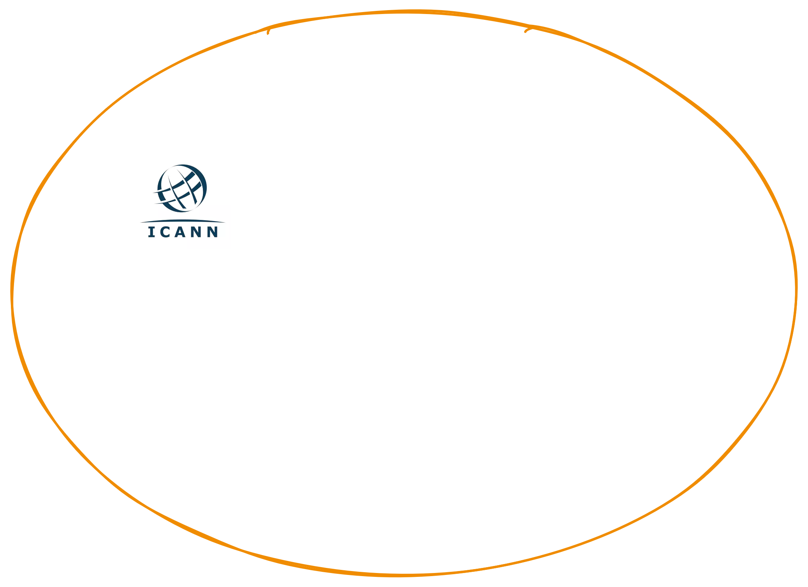
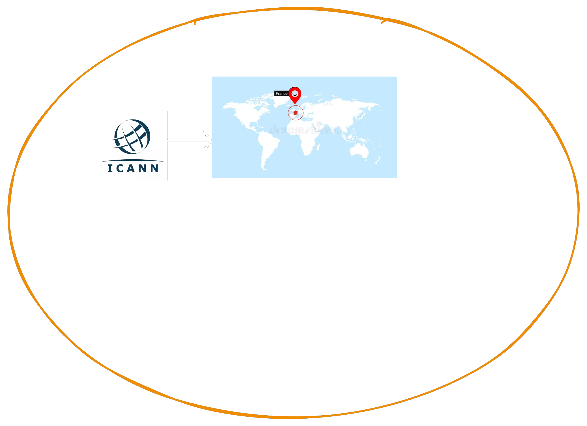
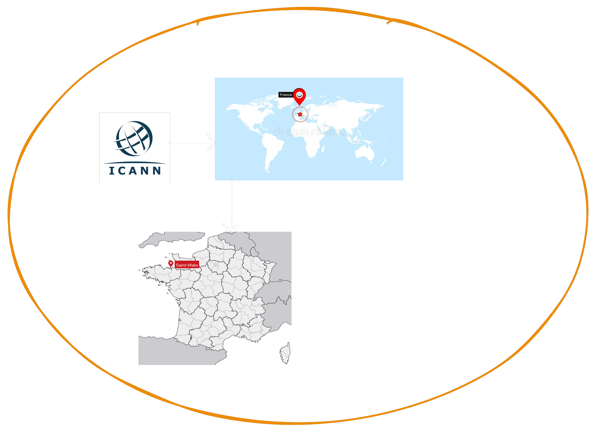
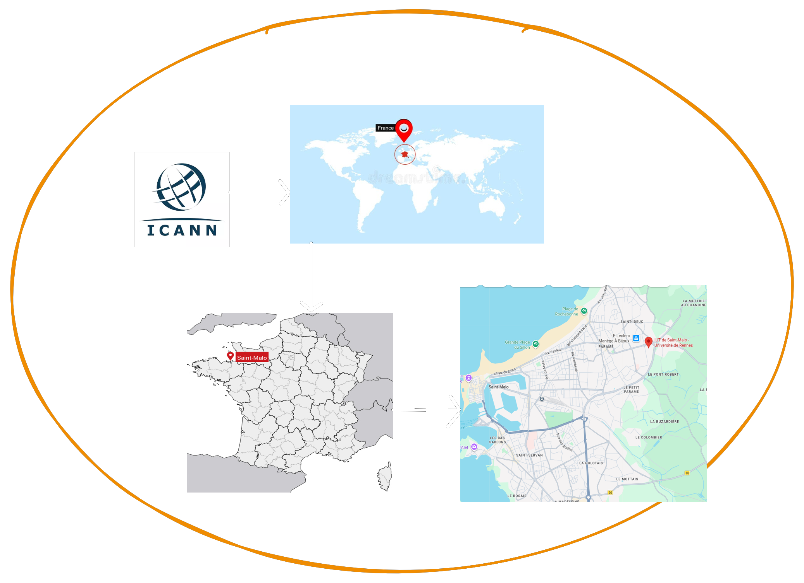
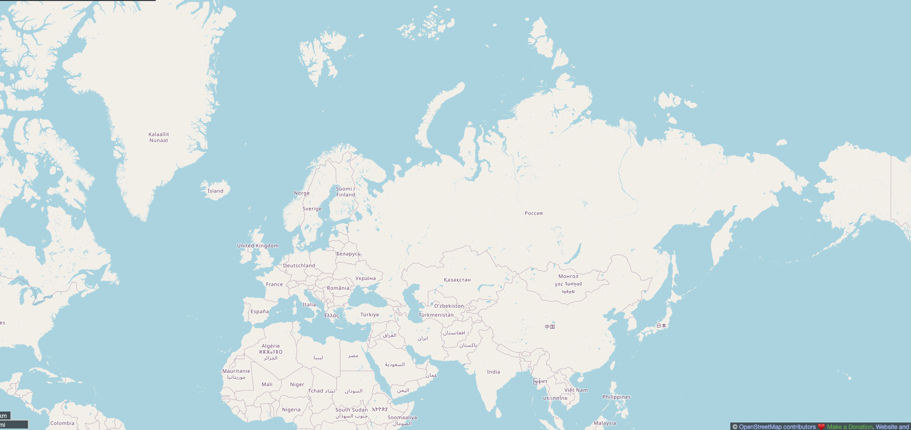

<!-- Éric -->

<!-- markdownlint-disable MD001 MD026 MD033 MD045 -->

<!-- Compile to HTML with `marp -w -s --html true .`
     (if it raises a watch error, disable git FS monitoring first with `git config core.fsmonitor false`) -->

<!-- Convert to HTML with: `marp --html true --title "Noms de domaines : la grande histoire des petites extensions" slide-deck.md` -->

<!-- Convert to PDF with:
```
CHROME_PATH=/Applications/Chromium.app/Contents/MacOS/Chromium marp --pdf --html true --allow-local-files true --title "Noms de domaines : la grande histoire des petites extensions" slide-deck.md && \
gs -q -dNOPAUSE -dBATCH -dSAFER -sDEVICE=pdfwrite -dCompatibilityLevel=1.4 -dPDFSETTINGS=/ebook -dEmbedAllFonts=true -dSubsetFonts=true -sOutputFile=slide-deck-ebook.pdf slide-deck.pdf && \
mv -f slide-deck-ebook.pdf slide-deck.pdf
```
  - update chrome path if needed (Chromium derivatives give better results than Firefox)
  - the generated PDF is recompressed (by compressing images) because it is huge
  - open PDF in browser to avoid bounding box artefacts
  - there are still some imperfections (missing UTF-8 characters…)
 -->

<!-- https://marpit.marp.app/markdown -->

<style>
    @import url('./slide-deck.css');
</style>

<div class="flex vertical center">


<!-- Photo de <a href="https://unsplash.com/fr/@choys_">Conny Schneider</a> sur <a href="https://unsplash.com/fr/photos/a-blue-background-with-lines-and-dots-xuTJZ7uD7PI">Unsplash</a> -->

# La grande histoire

## des petites **extensions**

### de **noms de domaines**

<div class="spacer"></div>

Théo Bougé & Eric Vergne - 

<div class="spacer"></div>

<div class="backgroundColorWhite">
* 
* 

</div>

</div>

---
<!-- Éric -->

<div class="flex vertical space-between">

## Qui sommes-nous ?

<div class="horizontal space-around">

<div class="vertical start">

### Théo


SRE Domaines

</div>
<div class="vertical start">

### Eric


Développeur DNS

</div>

</div>


---
<!-- Théo -->


<!-- Photo de <a href="https://unsplash.com/fr/@joshua_hoehne">Joshua Hoehne</a> sur <a href="https://unsplash.com/fr/photos/papier-dimprimante-blanc-avec-texte-noir-1UDjq8s8cy0">Unsplash</a> -->

<div class="flex vertical space-around">

# 1. Noms de domaines et extensions

</div>

---
<!-- Théo -->

<div class="flex vertical start">

## Nom de domaine

URL : `https://www.ovhcloud.com:8080/mail`

</div>

---
<!-- Théo -->

<div class="flex vertical start">

## Nom de domaine

URL : `https://www.ovhcloud.com:8080/mail`

- `https` : protocole
- `www` : nom d'hôte (machine) / sous-domaine
- `ovhcloud.com` : **nom de domaine**
- `8080` : port
- `/mail` : chemin d'accès

</div>

---
<!-- Théo -->

<div class="flex vertical start">

## `ovhcloud.com`

- `ovhcloud` : étiquette
- `com` : **extension**

</div>

---
<!-- Théo -->

<div class="flex vertical start">

## Quizz : quelle est l'extension ?

- `toto.fr`

</div>

---
<!-- Théo -->

<div class="flex vertical start">

## Quizz : quelle est l'extension ?

- `toto.fr` => `fr`
- `com.toto.fr`

</div>

---
<!-- Théo -->

<div class="flex vertical start">

## Quizz : quelle est l'extension ?

- `toto.fr` => `fr`
- `com.toto.fr` => `fr`
- `toto.gouv.fr`

</div>

---
<!-- Théo -->

<div class="flex vertical start">

## Quizz : quelle est l'extension ?

- `toto.fr` => `fr`
- `com.toto.fr` => `fr`
- `toto.gouv.fr` => `gouv.fr`
- `toto.com.fr`

</div>

---
<!-- Théo -->

<div class="flex vertical start">

## Quizz : quelle est l'extension ?

- `toto.fr` => `fr`
- `com.toto.fr` => `fr`
- `toto.gouv.fr` => `gouv.fr`
- `toto.com.fr` => `com.fr`
- `toto.fr.com`

</div>

---
<!-- Théo -->

<div class="flex vertical start">

## Quizz : quelle est l'extension ?

- `toto.fr` => `fr`
- `com.toto.fr` => `fr`
- `toto.gouv.fr` => `gouv.fr`
- `toto.com.fr` => `com.fr`
- `toto.fr.com` => `com`
- `toto.notaires.fr`

</div>

---
<!-- Théo -->

<div class="flex vertical start">

## Quizz : quelle est l'extension ?

- `toto.fr` => `fr`
- `com.toto.fr` => `fr`
- `toto.gouv.fr` => `gouv.fr`
- `toto.com.fr` => `com.fr`
- `toto.fr.com` => `com`
- `toto.notaires.fr` => `fr`

</div>

---
<!-- Théo -->

<div class="flex vertical start">

## Types d'extensions (1)

- **TLD** (Top-Level Domain) : `.fr`
- SLD (Second-Level Domain) : `.gouv.fr`
- 3LD (Third-Level Domain) : `.anjo.aichi.jp`

<div class="spacer"></div>

Liste publique (_non officielle_) sur https://publicsuffix.org/list/

</div>

---
<!-- Théo -->

<div class="flex vertical start">

## Types d'extensions (2)

- **ccTLD** (Country-Code TLD)
- **gTLD** (Generic TLD)

</div>

---
<!-- Théo -->

<div class="flex vertical start">

## Quizz : ccTLD 🏳️‍🌈 ou gTLD 🌍 ?

<div class="horizontal start">

- `fr`

</div>

---
<!-- Théo -->

<div class="flex vertical start">

## Quizz : ccTLD 🏳️‍🌈 ou gTLD 🌍 ?

<div class="horizontal start">

- `fr` => 🇫🇷
- `com`

</div>

---
<!-- Théo -->

<div class="flex vertical start">

## Quizz : ccTLD 🏳️‍🌈 ou gTLD 🌍 ?

<div class="horizontal start">

- `fr` => 🇫🇷
- `com` => 🌍
- `co`

</div>

---
<!-- Théo -->

<div class="flex vertical start">

## Quizz : ccTLD 🏳️‍🌈 ou gTLD 🌍 ?

<div class="horizontal start">

- `fr` => 🇫🇷
- `com` => 🌍
- `co` => 🇨🇴
- `gouv.fr`

</div>

---
<!-- Théo -->

<div class="flex vertical start">

## Quizz : ccTLD 🏳️‍🌈 ou gTLD 🌍 ?

<div class="horizontal start">

- `fr` => 🇫🇷
- `com` => 🌍
- `co` => 🇨🇴
- `gouv.fr` => 🇫🇷
- `bzh`

</div>

---
<!-- Théo -->

<div class="flex vertical start">

## Quizz : ccTLD 🏳️‍🌈 ou gTLD 🌍 ?

<div class="horizontal start">

- `fr` => 🇫🇷
- `com` => 🌍
- `co` => 🇨🇴
- `gouv.fr` => 🇫🇷
- `bzh` => 🌍
- `eu`

</div>

---
<!-- Théo -->

<div class="flex vertical start">

## Quizz : ccTLD 🏳️‍🌈 ou gTLD 🌍 ?

<div class="horizontal start">

- `fr` => 🇫🇷
- `com` => 🌍
- `co` => 🇨🇴
- `gouv.fr` => 🇫🇷
- `bzh` => 🌍
- `eu` => 🇪🇺

<div class="hspacer"></div>

- `ευ`

</div>

</div>

---
<!-- Théo -->

<div class="flex vertical start">

## Quizz : ccTLD 🏳️‍🌈 ou gTLD 🌍 ?

<div class="horizontal start">

- `fr` => 🇫🇷
- `com` => 🌍
- `co` => 🇨🇴
- `gouv.fr` => 🇫🇷
- `bzh` => 🌍
- `eu` => 🇪🇺

<div class="hspacer"></div>

- `ευ` => 🇪🇺
- `asia`

</div>

</div>

---
<!-- Théo -->

<div class="flex vertical start">

## Quizz : ccTLD 🏳️‍🌈 ou gTLD 🌍 ?

<div class="horizontal start">

- `fr` => 🇫🇷
- `com` => 🌍
- `co` => 🇨🇴
- `gouv.fr` => 🇫🇷
- `bzh` => 🌍
- `eu` => 🇪🇺

<div class="hspacer"></div>

- `ευ` => 🇪🇺
- `asia` => 🌍
- `dev`

</div>

</div>

---
<!-- Théo -->

<div class="flex vertical start">

## Quizz : ccTLD 🏳️‍🌈 ou gTLD 🌍 ?

<div class="horizontal start">

- `fr` => 🇫🇷
- `com` => 🌍
- `co` => 🇨🇴
- `gouv.fr` => 🇫🇷
- `bzh` => 🌍
- `eu` => 🇪🇺

<div class="hspacer"></div>

- `ευ` => 🇪🇺
- `asia` => 🌍
- `dev` => 🌍
- `ai`

</div>

</div>

---
<!-- Théo -->

<div class="flex vertical start">

## Quizz : ccTLD 🏳️‍🌈 ou gTLD 🌍 ?

<div class="horizontal start">

- `fr` => 🇫🇷
- `com` => 🌍
- `co` => 🇨🇴
- `gouv.fr` => 🇫🇷
- `bzh` => 🌍
- `eu` => 🇪🇺

<div class="hspacer"></div>

- `ευ` => 🇪🇺
- `asia` => 🌍
- `dev` => 🌍
- `ai` => 🇦🇮
- `tv`

</div>

</div>

---
<!-- Théo -->

<div class="flex vertical start">

## Quizz : ccTLD 🏳️‍🌈 ou gTLD 🌍 ?

<div class="horizontal start">

- `fr` => 🇫🇷
- `com` => 🌍
- `co` => 🇨🇴
- `gouv.fr` => 🇫🇷
- `bzh` => 🌍
- `eu` => 🇪🇺

<div class="hspacer"></div>

- `ευ` => 🇪🇺
- `asia` => 🌍
- `dev` => 🌍
- `ai` => 🇦🇮
- `tv` => 🇹🇻
- `radio`

</div>

---
<!-- Théo -->

<div class="flex vertical start">

## Quizz : ccTLD 🏳️‍🌈 ou gTLD 🌍 ?

<div class="horizontal start">

- `fr` => 🇫🇷
- `com` => 🌍
- `co` => 🇨🇴
- `gouv.fr` => 🇫🇷
- `bzh` => 🌍
- `eu` => 🇪🇺

<div class="hspacer"></div>

- `ευ` => 🇪🇺
- `asia` => 🌍
- `dev` => 🌍
- `ai` => 🇦🇮
- `tv` => 🇹🇻
- `radio` => 🌍

</div>

</div>

---
<!-- Théo -->

<div class="flex vertical start">

## Caractères spéciaux (non-ASCII)

- **IDN** (International Domain Name) depuis 2003
  - pour l'extension et/ou l'étiquette

- Conversion avec l'encodage _Punycode_
  - `ευ` <=> `xn--qxa6a`

</div>

---
<!-- Éric -->


<!-- Photo de <a href="https://unsplash.com/fr/@j_harris_391">Joshua Harris</a> sur <a href="https://unsplash.com/fr/photos/un-poteau-avec-un-tas-de-panneaux-de-signalisation-jaunes-dessus-BwH31YGYXho">Unsplash</a> -->

<div class="flex vertical space-around">

# 2. DNS

</div>

---
<!-- Éric -->

<div class="flex vertical start">


## Analogie

</div>

---
<!-- Éric -->

<!-- * La différence entre des coordonnées géographiques brutes (difficiles à retenir) et une adresse textuelle (humainement mémorisable). -->
<!-- * une racine, des maillons intermédiaires (le pays et la ville pour représenter les extensions) et des localisations précises pour les serveurs. -->
<!-- * Processus de résolution hiérarchique : la racine redirige vers le pays, qui oriente vers la ville, pour aboutir à la localisation finale du serveur. -->
<div class="flex vertical start">

| Adresse      | coordonnées géographiques |
| ----------- | ----------- |
| IUT de Saint-Malo, 40 Rue de la Croix Desilles, 35400 Saint-Malo, France      | 48°39'27.0"N 1°58'08.5"W       |


</div>

---
<!-- Éric -->

<div class="flex vertical start">



</div>

---
<!-- Éric -->

<div class="flex vertical start">



</div>

---
<!-- Éric -->

<div class="flex vertical start">



</div>

---
<!-- Éric -->

<div class="flex vertical start">



</div>

---
<!-- Éric -->

<div class="flex vertical start">


</div>

---
<!-- Éric -->

<div class="flex vertical start">

## Zonefile

```txt
$ORIGIN example.com.
$TTL 3600
example.com.  IN  SOA   ns.example.com. username.example.com. ( 2020091025 7200 3600 1209600 3600 )

example.com.  IN  NS    ns
example.com.  IN  NS    ns.somewhere.example.
example.com.  IN  MX    10 mail.example.com.
@             IN  MX    20 mail2.example.com.
@             IN  MX    50 mail3
example.com.  IN  A     192.0.2.1
              IN  AAAA  2001:db8:10::1
ns            IN  A     192.0.2.2
              IN  AAAA  2001:db8:10::2
www           IN  CNAME example.com.
wwwtest       IN  CNAME www
mail          IN  A     192.0.2.3
mail2         IN  A     192.0.2.4
mail3         IN  A     192.0.2.5
```

</div>

---
<!-- Éric -->

<div class="flex vertical start">

## Quizz ❓🧭

- www.toto.fr ? 🔍

</div>

---
<!-- Éric -->

<div class="flex vertical start">

## Quizz ❓🧭

- www.toto.fr ? 🔍
  DNS root 🌐 -> DNS fr 🇫🇷 -> DNS toto.fr ✅

</div>

---
<!-- Éric -->

<!--  * Centralisation mondiale : la racine principale est sous la gouvernance de l'ICANN, une organisation américaine. --> 
<!-- * Racines DNS alternatives : exemple d'OpenNIC qui permet de résoudre des extensions non officielles (comme .libre) tout en intégrant un repli (fallback) vers l'ICANN. -->  
<div class="flex vertical start">

## 🌐 Les DNS racines alternatifs

### 🆓 `.libre` / 🤓 `.geek`

```sh
~
❯ dig +short be.libre

~
❯ dig @94.247.43.254 +short be.libre
161.97.219.84
```

<div class="spacer"></div>

🔗 [opennic.org](https://opennic.org/)

</div>

---
<!-- Éric -->
<!--  * Extensions dépendantes de logiciels tiers : exemple du .onion accessible uniquement via l'outil et le réseau anonyme Tor. -->
 <!-- * Constat de traçabilité : l'existence de l'anonymat de Tor met en évidence le manque d'anonymat du reste d'Internet, posant la question de l'identification des propriétaires. -->  


<div class="flex vertical start">

## 🧅 .onion

###

- 🫥 Services "cachés" sur Tor
- 🔒 Anonyme et sécurisé
- 🚧 Pas accessible via DNS classique

<div class="spacer"></div>

🔗 [torproject.org](https://www.torproject.org/fr/download/)

</div>

---
<!-- Éric -->


<!-- Photo de <a href="https://unsplash.com/fr/@portmorien">Port Morien Digital Archive</a> sur <a href="https://unsplash.com/fr/photos/xPUzCnR_Vrw">Unsplash</a> -->

<div class="flex vertical space-around">

# 3. Annuaire Whois/RDAP

</div>

---
<!-- Éric -->

<div class="flex vertical start">

<!-- * Whois : né en 1982, protocole texte libre, utilisé pour connaître les infos d'un domaine -->
<!-- * Obsolète (pas de sécurité, pas de structure), non conforme RGPD -->
<!-- * Mort programmée en 2025 -->
<!-- * RDAP le remplace : structuré, sécurisé, conforme, arrive en 2015, devient obligatoire en 2025 -->

## Whois 👶 1982 → ☠️ 2025

- 📝 Texte libre
- 🤯 Pas de standard pour les clés ni le contenu

```txt
Domain Name: IUT-RT.NET
Registry Domain ID: 162256355_DOMAIN_NET-VRSN
Registrar URL: https://www.godaddy.com
Updated Date: 2021-05-23T15:10:10Z
Creation Date: 2005-05-27T03:23:18Z
```

</div>

---
<!-- Éric -->

<div class="flex vertical start">

## RDAP 🚀 2015 → ✅ 2025+

- 🧾 JSON + jCard via HTTPs
- 🕸️ Structuré, machine-readable

<div class="spacer"></div>

🔗 <a href="https://client.rdap.org/?type=domain&object=iut-rt.net" target="_blank">Voir RDAP pour iut-rt.net</a>

</div>

---
<!-- Théo -->


<!-- Photo de <a href="https://unsplash.com/fr/@kyleunderscorehead">Kyle Head</a> sur <a href="https://unsplash.com/fr/photos/silhouette-de-trois-interprete
s-sur-scene-p6rNTdAPbuk">Unsplash</a> -->

<div class="flex vertical space-around">

# 4. Acteurs

</div>

---
<!-- Théo -->

<div class="flex vertical start">

## Principaux acteurs


<!-- ICANN (Internet Corporation for Assigned Names and Numbers) : créée en 1998, "indépendante" en 2016 -->

</div>

---
<!-- Théo -->

<div class="flex vertical start">

## Autres acteurs

- 🗂️ Dépositaire des données
- 👨‍👦‍👦 Bureau d'enregistrement _proxy_

</div>

---
<!-- Théo -->

<div class="flex vertical start">

## Autres acteurs

- 🗂️ Dépositaire des données
- 👨‍👦‍👦 Bureau d'enregistrement _proxy_

<div class="spacer"></div>

- 🏴‍☠️ Spammer, phisher
- 💰 Domainer

</div>

---
<!-- Éric -->


<!-- Photo de <a href="https://unsplash.com/fr/@lemonvlad">Vladislav Klapin</a> sur <a href="https://unsplash.com/fr/photos/pavillon-assorti-YeO44yVTl20">Unsplash</a> -->

<div class="flex vertical space-around">

# 5. Country-Codes TLDs (ccTLDs)

</div>


---
<!-- Éric -->

<div class="flex vertical start">

## `ai` ?

</div>

---
<!-- Éric -->


<!-- Source : https://www.openstreetmap.org/?mlat=18.22&mlon=-63.06#map=8/18.22/-63.06 -->

<div class="flex vertical start">

## `ai` : Anguilla 🇦🇮

<!-- 30 % du PIB -->
<!-- > 1 million de domaines -->
<!-- 80$ / an -->

</div>

---
<!-- Éric -->

<div class="flex vertical start">

## `yt` ?

</div>

---
<!-- Éric -->


<!-- Source : https://www.openstreetmap.org/?mlat=-12.83&mlon=45.17#map=8/-12.83/45.17 -->

<!-- * ccTLD officiel de Mayotte (France) soumis aux stricts critères d'éligibilité du .fr. -->
<!-- * Conséquence commerciale : obligation d'être citoyen européen pour l'acquérir, ce qui empêche les acteurs américains (dont YouTube) de le racheter librement. -->  

<div class="flex vertical start">

## `yt` : Mayotte 🇾🇹

</div>

---
<!-- Éric -->

<div class="flex vertical start">

## `ly` ?

</div>

---
<!-- Éric -->


<!-- Source : https://www.openstreetmap.org/?mlat=26.34&mlon=17.23#map=5/26.34/17.23 -->

<div class="flex vertical start">

## `ly` : Libye 🇱🇾

</div>

<!-- 0,015% du PIB -->
<!--  * extension de la Libye historiquement exploitée par le raccourcisseur d'URL Bitly (bit.ly). -->  
<!--  * Risque d'infrastructure : l'interruption d'Internet au niveau national par la Libye a causé la coupure instantanée du service, poussant Bitly à migrer vers un .com. -->  
<div class="flex vertical start">
---
<!-- Éric -->

<div class="flex vertical start">

## `yu` ?

</div>

---
<!-- Éric -->


<!-- Source : https://www.openstreetmap.org/#map=6/41.80/16.08 -->


## `yu` : Yougoslavie

<!-- 1989 : Création de l'extension en 1989 -->
<!-- 1991 : Scission de la Yougoslavie en 1991 (Slovénie et Croatie deviennent indépendantes) -->
<!-- 1991 (fin) : début de l'exploitation de l'extension .yu -->
<!-- 1992 : des agents slovènes volent la base de données et détruisent l'extension -->
<!-- 1994 : La Serbie reprend la gestion de l'extension .yu -->
<!-- 2002 : l'extension n'est plus commercialisée (.rs privilégié pour la Serbie) -->
<!-- 2010 : suppression définitive, 4 000 domaines détruits -->

</div>

---
<!-- Éric -->

<div class="flex vertical start">

## `su` ?

</div>

---
<!-- Éric -->



<!-- Source : https://www.openstreetmap.org/#map=3/62.92/67.32 -->

<div class="flex vertical start">

## `su` : Union Soviétique

<!-- Création de l'extension en 1990 -->
<!-- Disparition de l'URSS en 1991, mais l'extension .su reste active -->
<!-- 2001 : ICANN propose la suppression, mais refusée -->
<!-- Toujours active en 2026, ≃100 000 domaines -->

</div>

---
<!-- Théo -->


<!-- Photo de <a href="https://unsplash.com/fr/@carl_wang">Carl Wang</a> sur <a href="https://unsplash.com/fr/photos/une-vue-de-la-terre-depuis-lespace-OCe8cTGymSQ">Unsplash</a> -->

<div class="flex vertical space-around">

# 6. Generic TLDs (gTLDs)

</div>

---
<!-- Théo -->

<div class="flex vertical start">

## Les premiers gTLDs

- **1985** : com, net, org, edu, gov, mil, int
- **2000** : aero, biz, coop, info, museum, name, pro
- **2004** : asia, cat, jobs, mobi, tel, travel

</div>

---
<!-- Théo -->

<div class="flex vertical start">

## Nouveaux gTLDs (2012)

<div class="horizontal start">

- Frais de dossier
  **185 000$**
- Processus ➡️

<div class="hspacer"></div>


<!-- Source : https://newgtlds.icann.org/en/applicants/agb / https://archive.icann.org/fr/topics/new-gtlds/intro-redline-12nov10-fr.pdf -->
</div>

</div>

---
<!-- Théo -->

<div class="flex vertical start">

## Nouveaux gTLDs (2012)

<div class="horizontal start">

- Frais de dossier
  **185 000$**
- Processus ➡️
  (si conflits)

<div class="hspacer"></div>


<!-- Source : https://newgtlds.icann.org/en/applicants/agb / https://archive.icann.org/fr/topics/new-gtlds/intro-redline-12nov10-fr.pdf -->
</div>

</div>

---
<!-- Théo -->

<div class="flex vertical start">

## Dernières validations


<!-- Source : https://newgtlds.icann.org/en/program-status/delegated-strings -->

- Exemple : `mobile` validé fin 2016, ouvert février 2026
  <!-- https://domainnamewire.com/2026/02/04/mobile-domain-names-become-available-today/ -->

</div>

---
<!-- Théo -->

<div class="flex vertical start">

## Extensions internationales

<div class="horizontal start">

- `paris`
- `bzh`
- `africa`

<div class="hspacer"></div>

- `中国` (China)
- `コム` (Japan)
- `عرب` (Arab)

</div>

---
<!-- Éric -->

<!-- _backgroundColor: darkslategray -->
<!-- * Extensions exclusives réservées à un usage interne (ex: .google, .leclerc) pour sanctuariser l'image de marque.-->  
<!-- * Eviter le phishing-->
<div class="flex vertical start">

## Extensions d'entreprise

### (usage interne)

<div class="flex horizontal start">

- `leclerc` 🔗 <a href="https://location.leclerc" target="_blank">location.leclerc</a>
- `cuisinella` 🔗 <a href="https://www.ma.cuisinella" target="_blank">www.ma.cuisinella</a>
- `google` 🔗 <a href="https://blog.google" target="_blank">blog.google</a>

</div>
</div>

---
<!-- Théo -->

<div class="flex vertical start">

## Extensions d'entreprise

### (vente publique)

- `ovh`

<!-- https://www.ovhcloud.com/fr/domains/tld/end-tld-ovh/ -->

</div>

---
<!-- Éric -->

<!-- _backgroundColor: darkslategray -->
<!--  *  suppressions volontaires : abandon du .sncf (anciennement wifi.sncf) au profit de SNCF Connect, désormais cantonné aux usages internes et à authentification.sncf. -->  
<!--  * Optimisation budgétaire : demande de suppression complète de l'extension propre de Goodyear pour s'affranchir des redevances annuelles dues à l'ICANN.   -->
<div class="flex vertical start">

## Extensions supprimées

- `sncf` (plus vraiment utilisé)
- `goodyear` (supprimé)

</div>

---
<!-- Théo -->

<div class="flex vertical start">

## Extensions avec contraintes

- `dev`, `app` (HTTPS obligatoire)

</div>

---
<!-- Éric -->

<!-- _backgroundColor: darkslategray -->

## Tarification

<div class="flex vertical start">

- `security`, `auto` (≃2500€/an)

</div>

---
<!-- Théo -->

## Business model

<div class="flex vertical start">

- `sucks`

</div>

---
<!-- Éric -->

<!-- _backgroundColor: darkslategray -->
<!-- * Domaines réservés : extensions bloquées par l'ICANN à des fins exclusives de documentation et de tests (.example, .localhost, .test, .invalid). -->  
<!--  * Protections anti-collision : rejet en 2012 des extensions .corp et .home pour éliminer les risques de conflit avec les architectures réseaux internes des entreprises. -->  
## Extensions réservées

<div class="flex vertical start">

- `example` / `local` / `invalid` (non routées)
- `corp` / `home` (dossiers refusés)

<!-- Liste complète : https://www.iana.org/assignments/special-use-domain-names/special-use-domain-names.xhtml -->

</div>

---
<!-- Théo -->

## Conflits

<div class="flex vertical start">

- 🍷🍾 [`wine`](https://www.larvf.com/,vin-internet-nom-wine-lancement-donuts-domaine,4477645.asp)

</div>

---
<!-- Éric -->

<!--  * Conflit géopolitique du .amazon : contestation par les pays de la région du fleuve Amazone contre l'attribution à la firme technologique. -->  
<!--  * Compromis trouvé : octroi d'un droit de préemption local et engagement d'Amazon à restreindre l'extension à un usage purement corporate interne. -->

<!-- _backgroundColor: darkslategray -->

## Conflits

<div class="flex vertical start">

- 🍷🍾 [`wine`](https://www.larvf.com/,vin-internet-nom-wine-lancement-donuts-domaine,4477645.asp) : délégué en 2015 ✅
- 🌳🌴 [`amazon`](https://archive.wikiwix.com/cache/?url=https%3A%2F%2Fwww.bna.com%2Famazon-internet-domain-b73014471531%2F)

</div>

---
<!-- Théo -->

## Conflits

<div class="flex vertical start">

- 🍷🍾 [`wine`](https://www.larvf.com/,vin-internet-nom-wine-lancement-donuts-domaine,4477645.asp) : délégué en 2015 ✅
- 🌳🌴 [`amazon`](https://archive.wikiwix.com/cache/?url=https%3A%2F%2Fwww.bna.com%2Famazon-internet-domain-b73014471531%2F) : délégué en 2020 ✅
- 🌎🕸️ [`web`](https://domainincite.com/27950-verisign-and-afilias-spar-over-web-delays)

</div>

---
<!-- Théo -->

## Conflits

<div class="flex vertical start">

- 🍷🍾 [`wine`](https://www.larvf.com/,vin-internet-nom-wine-lancement-donuts-domaine,4477645.asp) : délégué en 2015 ✅
- 🌳🌴 [`amazon`](https://archive.wikiwix.com/cache/?url=https%3A%2F%2Fwww.bna.com%2Famazon-internet-domain-b73014471531%2F) : délégué en 2020 ✅
- 🌎🕸️ [`web`](https://domainincite.com/tag/web) : toujours non résolu ! ❌

<!--

### Histoire du `web`

- https://domainincite.com/tag/web
- https://domainincite.com/23758-verisign-says-afilias-tried-to-rig-web-auction
- https://domainincite.com/26737-web-ruling-hands-afilias-a-chance-verisign-a-problem-and-icann-its-own-ass-on-a-plate

  > The case came about due to a dispute about the .web auction, which was run by ICANN in July 2016.
  >
  > Six of the seven .web applicants had been keen for the contention set to be settled privately, in an auction that would have seen the winning bid distributed evenly among the losing bidders.
  >
  > But Nu Dot Co (NDC), an application vehicle not known to be particularly well-funded, held out for a “last resort” auction, in which the winning bid would be deposited directly into ICANN’s coffers.
  >
  > This raised suspicions that NDC [had a secret sugar daddy](http://domainincite.com/20748-is-verisign-web-applicants-secret-sugar-daddy), likely Verisign, that was covertly bankrolling its bid.
  >
  > It was not known until after NDC won, [with a $135 million bid](http://domainincite.com/20820-verisign-likely-135-million-winner-of-web-gtld), that these suspicions were correct. NDC and Verisign had a “Domain Acquisition Agreement” or DAA that would see NDC transfer its .web contract to Verisign in exchange for the money needed to win the auction (and presumably other considerations, though almost all references to the terms of the DAA have been redacted by ICANN throughout the IRP).
  >
  > Afilias and fellow .web applicant Donuts both approached ICANN before and after the auction, complaining that the NDC/Verisign bid was bogus, in violation of program rules requiring applicants to notify ICANN if there’s any change of control of their applications, including agreements to transfer the gTLD post-contracting.

- https://domainincite.com/28757-verisign-will-get-web-icann-rules : Icann dit que c'est OK
- https://domainincite.com/28948-web-hit-by-second-icann-complaint / https://domainincite.com/29159-web-fight-back-in-court / https://domainnamewire.com/2023/05/16/web-may-face-more-delays-as-altanovo-fights-on/ : Afilias re-conteste

-->

</div>

---
<!-- Éric -->

<div class="flex vertical start">

## Bilan du round

- 2 000 candidatures reçues <!-- https://newgtlds.icann.org/en/program-status/statistics -->
- 1 400 extensions demandées <!-- https://icannwiki.org/New_gTLD_Program_(2012) -->
- 1 200 approuvées <!-- https://gtldresult.icann.org/applicationstatus/viewstatus -->
- 1 153 activées <!-- https://www.ntldstats.com/tld -->

</div>

---
<!-- Éric -->

<div class="flex vertical start">

### Adoption des nouveaux gTLD (2026)

| Extension   | Domaines enregistrés | % du round |
| ----------- | -------------------- | ---------- |
| **.xyz**    | 9 937 920            | 14%        |
| **.top**    | 8 359 616            | 12%        |
| **.shop**   | 5 665 110            | 8%         |
| **.online** | 4 930 765            | 7%         |

</div>

---
<!-- Éric -->

<div class="flex vertical start">

### Adoption des nouveaux gTLD (2026)

| Extension   | Domaines enregistrés | % du round |
| ----------- | -------------------- | ---------- |
| **.xyz**    | 9 937 920            | 14%        |
| **.top**    | 8 359 616            | 12%        |
| **.shop**   | 5 665 110            | 8%         |
| **.online** | 4 930 765            | 7%         |
|             |                      |            |
| _.com_ 🌍   | ~ 309 971 407        |            |
| _.cn_ 🇨🇳    | ~ 37 690 649         |            |
| _\*_        | ~ 836 632 916        |            |

<!-- https://www.ntldstats.com/tld/ -->
<!-- https://domainnamestat.com/statistics/overview -->

<!-- plus ou moins le meme nombre que le .io ou .ai -->

</div>

---
<!-- Éric -->

<div class="flex vertical start">

### Principales enchères gTLD 💰

| Extension | Montant de l'enchère | Candidat gagnant |
| --------- | -------------------- | ---------------- |
| **.TECH** | $ 6 760 000          | Dot Tech         |

</div>

---
<!-- Éric -->

<div class="flex vertical start">

### Principales enchères gTLD 💰

| Extension | Montant de l'enchère | Candidat gagnant |
| --------- | -------------------- | ---------------- |
| **.TECH** | $ 6 760 000          | Dot Tech         |
| **.BLOG** | $ 8 000 000          | Automattic       |

</div>

---
<!-- Éric -->

<div class="flex vertical start">

### Principales enchères gTLD 💰💰

| Extension | Montant de l'enchère | Candidat gagnant |
| --------- | -------------------- | ---------------- |
| **.TECH** | $ 6 760 000          | Dot Tech         |
| **.BLOG** | $ 8 000 000          | Automattic       |
| **.APP**  | $ 25 001 000         | Google           |

</div>

---
<!-- Éric -->

<div class="flex vertical start">

### Principales enchères gTLD 💰💰

| Extension | Montant de l'enchère | Candidat gagnant |
| --------- | -------------------- | ---------------- |
| **.TECH** | $ 6 760 000          | Dot Tech         |
| **.BLOG** | $ 8 000 000          | Automattic       |
| **.APP**  | $ 25 001 000         | Google           |
| **.SHOP** | $ 41 500 000         | GMO Registry     |

</div>

---
<!-- Éric -->

<div class="flex vertical start">

### Principales enchères gTLD 💰💰💰

| Extension | Montant de l'enchère | Candidat gagnant |
| --------- | -------------------- | ---------------- |
| **.TECH** | $ 6 760 000          | Dot Tech         |
| **.BLOG** | $ 8 000 000          | Automattic       |
| **.APP**  | $ 25 001 000         | Google           |
| **.SHOP** | $ 41 500 000         | GMO Registry     |
| **.WEB**  | $ 135 000 000        | Verisign         |

<!-- témoignage Radix : https://domainincite.com/28352-interview-sandeep-ramchandani-on-10-years-of-radix-and-new-gtlds -->

</div>

---
<!-- Théo -->


<!-- Photo de <a href="https://unsplash.com/fr/@simonesecci">Simone Secci</a> sur <a href="https://unsplash.com/fr/photos/lettres-rouges-neon-49uySSA678U">Unsplash</a> -->

<div class="flex vertical space-around">

# 7. Nouveau round gTLDs

</div>

---
<!-- Théo -->

<div class="flex vertical start">

## Processus

<!-- Infos : https://newgtldprogram.icann.org/en/resources/ChampionsToolkit -->
<!-- Dates : https://domainincite.com/31571-icann-maps-out-new-gtld-timeline -->

**Pré-requis** : capacité technique, vision long-terme

<div class="spacer"/>

- 🗓️ À partir du 30 avril 2026, pendant ~3 mois
  - 🧰 évaluation technique distincte
- 💰 **227 000$** (réductions possibles… pour ≃40 organisations)
  - +92 000$ pour backend technique
  - 🔨 enchères internes/externes ? [RFI en cours](https://www.icann.org/fr/announcements/details/icann-rfi-new-gtld-program-next-round-auctions-18-08-2025-fr)

</div>

---
<!-- Théo -->

<div class="flex vertical start">

## Perspectives

- 👫 **Grand public** : pas grand chose
- 🏢 **Demandeurs** :
  - réservation de sa marque
    <!-- Témoignage Google : https://domainnamewire.com/2025/10/10/google-pitches-dot-brand-top-level-domain-names/ -->
    <!-- Arguments Netim : https://blog.netim.com/fr/noms-de-domaine/extension-personnalisee-dotbrand-point-marque-15123/#Pourquoi_creer_sa_propre_extension -->
  - garantir l’authenticité et la sécurité des sites institutionnels
  - vente aux grosses marques
- 🔄 Début d'un nouveau cycle (?)

</div>

---


<!-- Photo de <a href="https://unsplash.com/fr/@impatrickt">Patrick Tomasso</a> sur <a href="https://unsplash.com/fr/photos/ampoules-vintage-allumees-1NTFSnV-KLs">Unsplash</a> -->

<div class="flex vertical space-around">

# 8. Autres horizons

</div>

---
<div class="flex vertical start">

## #PasAssezDeTempsPourToutDire

- 🛍️ Aftermarket
  <!-- SEDO / Afternic -->
  <!-- 70M$ pour ai.com en 2025 : https://domainincite.com/31543-ai-com-the-most-expensive-domain-sale-ever -->
- 🔐 NFT / Web 3 : `.eth` -> `web3.js`
  <!-- basé sur les smart contract -->
- ⚔️ Bataille à venir : `.agi`
  <!-- artificial general intelligence -->
  <!--https://domainincite.com/31315-ai-rival-lines-up-gtld-bid-->
  <!--https://unstoppabledomains.com/blog/categories/announcements/article/agi-tld-->

</div>

---


<!-- Photo de <a href="https://unsplash.com/fr/@simonesecci">Simone Secci</a> sur <a href="https://unsplash.com/fr/photos/lettres-rouges-neon-49uySSA678U">Unsplash</a> -->

<div class="flex vertical space-between">

# Questions & feedbacks

<div class="horizontal space-between bottom-align">

<div class="flex vertical space-between top-align">

<div class="footnotes">

Slides: [https://github.com/Preovaleo/talk-extensions](https://https://github.com/Preovaleo/talk-extensions/)

</div>
